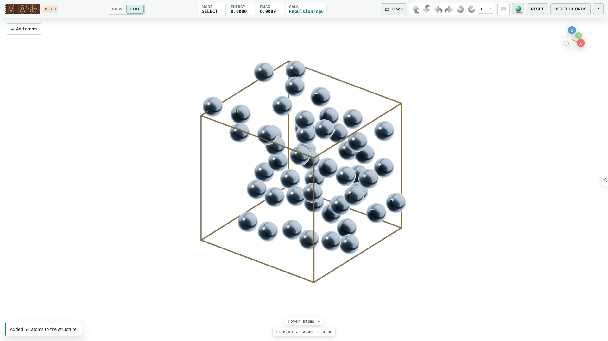

# Build atomic and molecular distributions

Use this workflow to prepare a mixed structure with reproducible positions and
remove short contacts before a simulation. The output is a starting geometry;
its density, chemistry, and thermodynamic state still need a suitable physical
model. Start with **Edit > + Add atoms > Batch**.

```{contents} On this page
:local:
:depth: 1
```

## Choose an initial distribution

| Distribution | What it does | Use it for |
| --- | --- | --- |
| Random | Independent volume-uniform samples, including in triclinic cells | Independent random initial configurations |
| Homogeneous | Greedy farthest-site selection from a scrambled Sobol pool up to 1,024 entities; the Sobol sequence directly for larger batches | Reducing large voids and clusters before relaxation |
| Regular grid | Global Cartesian grid clipped to the insertion domain | Controlled initial spacing |

An entity is one atom or one molecular anchor. Homogeneous points are correlated:
they are neither an ideal gas sample nor a globally optimal packing. No mode
guarantees a minimum distance to the host. For mixtures, a seeded site permutation
assigns species without tying chemical identity to grid order or maximin rank.
Atom labels and entry order remain stable. Specify a seed to reproduce the same
release's result; corrected algorithms can change positions between releases.

**Cartesian distance / Å** ranks real Euclidean distances. **Fractional spacing**
ranks normalized lattice coordinates, which can have very different physical
lengths in an anisotropic cell. Enable **Account for periodic boundaries** to
include opposite-face neighbors in the spacing metric. Triclinic Cartesian
spacing uses a reduced-lattice minimum-image search.

## Create a Cu–Zr starting structure in the GUI

1. Run `v_ase gui`. Under **Structure > Cell & Replication**, set a diagonal
   20 Å cell and enable all three periodic axes.
2. Open **+ Add atoms > Batch > Atoms**. Add Cu and Zr rows with 100 atoms each.
3. Choose **Homogeneous**, **Cartesian distance / Å**, and a fixed seed such as 19.
4. Scatter the batch. Verify 200 staged atoms and the requested composition.
5. Open **Structure > Relaxation**, inspect the independent repulsion pair
   distances, and run placement relaxation. The default host-freezing option
   matters when inserting into an existing structure.
6. Inspect short contacts and the timeline, then choose **Finish** to commit.
   **Cancel** restores the structure from before the whole placement session.

The counts and cell above demonstrate the controls; they do not prescribe a
realistic Cu–Zr density. Set composition and volume from your intended model.



## Define where insertion is allowed

A finite unit cell defines the base domain. Allow boxes restrict it to their
union, and Reject boxes subtract their union; overlapping regions count once.
Without a cell, at least one finite Allow region is required.

Region coordinates are Cartesian bounds in Å. **Region MIC** periodically maps
regions; **Account for periodic boundaries** controls the placement spacing
metric. These are different settings. **Constrain to domain** controls subsequent
relaxation: an insertion region alone does not confine later motion.

For **Regular grid**, an explicit spacing is never silently reduced. If too few
sites fit, reduce the count, enlarge the domain, or choose another spacing.

## Understand the repulsion calculator

For each enabled label or element pair with onset distance `rc`, v_ase uses:

```text
U(r) = k/2 × (rc − r)²  for r < rc; otherwise 0
|F(r)| = k × (rc − r)   for r < rc; otherwise 0
```

`rc` is in Šand `k` in eV/Ų. Absolute mode uses the entered distance; scaled
mode multiplies a reference contact distance by the scale. A zero pair distance
disables that pair. These settings are independent of displayed bonds.

By default, forces are the negative gradient of the reported energy. Periodic
interactions include all images within the cutoff, including images of the
same basis atom. This preserves energy per atom when an identical crystal is
represented as a larger supercell. The legacy Python `mic` flag enables these
periodic interactions; it does not restrict the sum to a single nearest image.

At exactly coincident positions, the radial derivative has no unique direction;
v_ase uses a deterministic separating direction. An explicit Python
`max_force_norm` requests the legacy force limiter and therefore a force that is
no longer the gradient of the reported energy. Its default is now `None`.

Repulsion supplies no attraction or chemistry. A small `fmax` means the
optimizer's force criterion is met; it does not prove all overlaps are gone,
because forces can cancel. A periodic self-image overlap cannot be removed by
moving a single basis atom at fixed cell. Check distances and cell size as well
as convergence, then relax with your intended interatomic potential or DFT model.

## Prepare a distribution in Python

This complete example generates 128 volume-uniform Ar positions, relaxes the
soft overlap energy, and opens the result. It creates no equilibrium ensemble.

```python
import numpy as np
from ase import Atoms
from ase.optimize import FIRE
from v_ase import view
from v_ase.repulsion import RepulsionCalculator

rng = np.random.default_rng(19)
cell = np.eye(3) * 20.0
atoms = Atoms("Ar128", scaled_positions=rng.random((128, 3)), cell=cell, pbc=True)
atoms.calc = RepulsionCalculator(cutoff_distance=2.5, k_repulsion=1.0)
optimizer = FIRE(atoms, logfile=None)
converged = optimizer.run(fmax=0.02, steps=200)
print("Force criterion met:", converged)
print("Overlap penalty / eV:", atoms.get_potential_energy())
view(atoms)
```

The cell is fixed. `cutoff_distance` changes the onset of repulsion;
`fmax` changes the stopping criterion, not the target distance.

## Insert rigid molecules

Choose **Batch > Molecules**, then counts or target density. The density uses
the accessible domain volume and the nearest complete composition batch, so
inspect both target and realized density. Random orientation is uniform in 3D.
An anchor uses the ASE molecule's native origin, not necessarily its center of mass.

**Preserve molecular geometry** keeps intramolecular distances fixed. Internal
repulsion is excluded within the reference molecule; its periodic copies are
separate molecules and still interact. Choose a cell large enough for the
whole molecule and inspect contacts after relaxation.

## Verify and save

Check counts, chemical elements, labels, domain membership, host coordinates,
molecular geometry, and short periodic distances. Use [RDF](rdf.md) to inspect
pair statistics with the correct boundary convention. Finish staging before
exporting simulation input; save a `.vase` project to retain the complete view.

See [scientific validation](scientific-validation.md) for independent tests,
performance measurements, and the limits of these algorithms.
