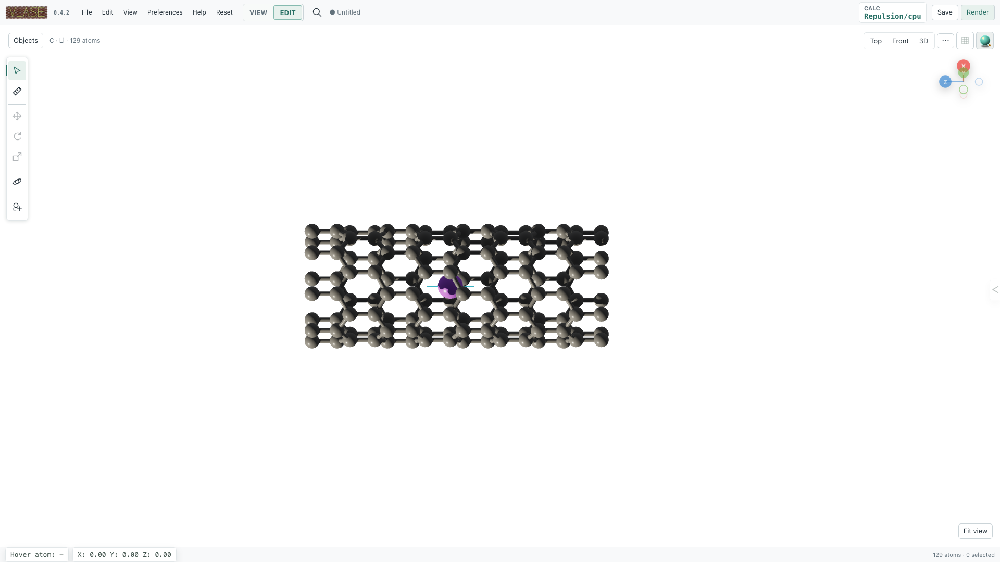
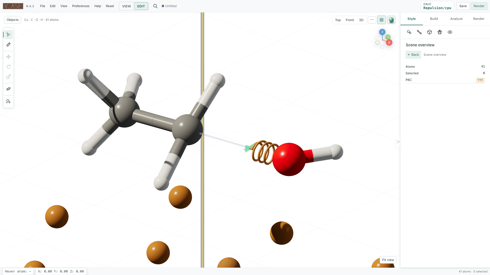
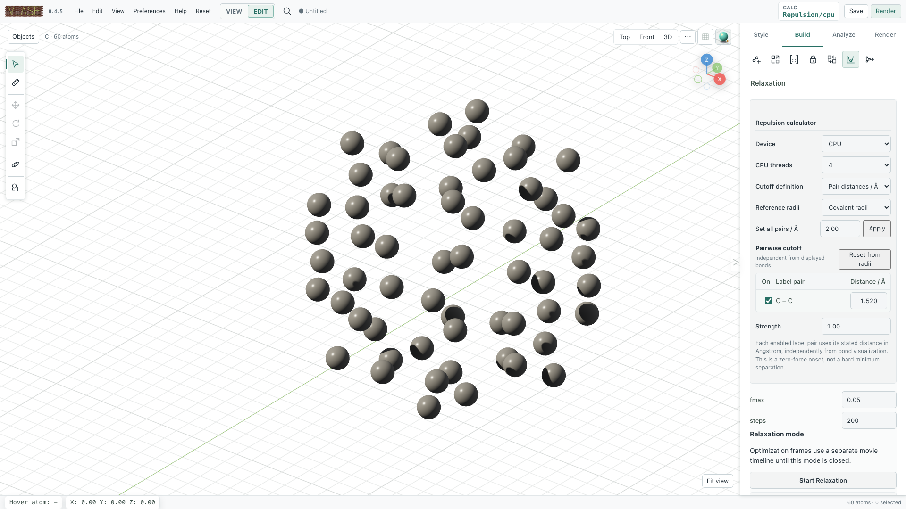

# Constraints and relaxation

v_ase uses ASE as the authority for constrained coordinates and optimizer
state. Constraint graphics explain permitted motion, but they do not replace
the underlying ASE constraint or change its force law.

## Constraint enforcement

Open **Structure > Constraints** in Edit. **Apply constraints** is enabled by
default. A viewport transform is previewed interactively, then the proposed
coordinates are committed through ASE and the backend returns the constrained
result.

Turning **Apply constraints** off permits an unconstrained coordinate commit.
It does not remove the constraint from the ASE object. Re-enable it before the
next operation when subsequent edits should respect the stored constraint.

:::{admonition} Verify the committed coordinates
:class: important
The browser preview is not the scientific result. After moving a constrained
atom, inspect the returned position or reopen the structure state. FixedLine
and FixedPlane may remove components of the pointer-driven displacement.
:::

## Supported constraint state

v_ase preserves and serializes common ASE constraints, including FixAtoms,
FixCartesian, FixedLine, FixedPlane, FixScaled, and Hookean. The built-in
constraint editor creates or clears FixAtoms and the supported directional
FixedLine/FixedPlane forms. Existing FixScaled, FixCartesian, and Hookean
objects are preserved and rendered according to their ASE semantics rather
than converted into a different backend constraint.

### FixAtoms

FixAtoms prevents all Cartesian motion for its atom indices. Fixed atoms keep
their element color but use a distinct constrained surface treatment. In the
scene-wide **2D flat** rendering mode they also receive an X marker.

To change selected atoms, use the **FixAtoms** control and apply the change.
Recheck the selected indices afterward, especially if topology was edited.

### FixedLine

FixedLine allows motion only along one direction vector. Each constrained atom
has its own short cyan axis, visible without selection. Starting `G` adds one
long guide through the atom's original position; rings and plane discs are not
used for a line constraint.

To create it:

1. Select the intended atoms in Edit.
2. Choose **Directional > FixedLine**.
3. enter a nonzero three-component **Vector**;
4. select **Apply Direction**; and
5. move the atom and verify that only the vector-parallel displacement
   survives the backend commit.



### FixedPlane

FixedPlane allows motion inside the plane whose normal is the stored direction
vector. Each constrained atom retains a local ring, crosshair, and normal
marker. Starting `G` adds a larger translucent permitted plane anchored at
that atom's original position. A multi-selection keeps independent per-atom
planes; v_ase does not substitute one center-of-mass plane.

Create it by selecting **Directional > FixedPlane**, supplying a nonzero
normal vector, and choosing **Apply Direction**. Confirm a test move with both
in-plane and normal components and verify that the normal component was
removed.


### FixScaled and FixCartesian

VASP selective dynamics commonly enters ASE as FixScaled. v_ase derives its
guide from allowed fractional cell directions:

- no allowed directions renders as fully fixed;
- one allowed direction renders as a line along the corresponding cell
  vector; and
- two allowed directions render as a plane spanned by those cell vectors.

This visualization remains cell-aware in skewed cells. Existing FixCartesian
component masks are retained in serialized scientific state. Use ASE/Python
when a workflow needs to author a constraint form that the GUI editor does not
create directly.

### Hookean

For ASE `Hookean(a1, a2, rt, k)`, the spring is inactive at `r <= rt` and the
restoring-force magnitude after activation is:

```text
|F| = k (r - rt),  for r > rt
```

v_ase reads `rt` and `k` from the live constraint. The 3D helix appears only
when the displayed distance is beyond the threshold and follows every
trajectory frame. It adds no numerical annotation that could obscure a dense
structure and does not modify ASE's force calculation.



### Clear a directional constraint

Select the atoms and choose **Clear Direction**. This removes the supported
FixedLine/FixedPlane state while leaving the separate FixAtoms setting as
configured. Verify the constraint summary before continuing.

## Constraint-safe topology operations

Deletion, duplication, supercell construction, and trajectory-wide changes
must remap or repeat supported atom indices. v_ase performs these operations in
the backend and records them in history. After any atom-count change:

- inspect the constraint summary again;
- do not reuse old atom indices blindly;
- confirm that a supercell repeated each intended constraint; and
- verify that an Undo restores both topology and constraints.

Temporary fixed-host markers during Batch Add Atoms are not committed ASE
constraints. They exist only in the staging optimizer and disappear after
**Finish** or **Cancel**.

## Relaxation prerequisites

Open **Structure > Relaxation** in Edit. Ordinary structure relaxation requires
an attached ASE calculator. When a structure enters Edit without a calculator,
v_ase attaches its built-in soft-repulsion fallback; View mode does not attach
one. User-supplied ASE calculators are preserved.

:::{warning}
The built-in calculator is a geometry conditioner for obvious short contacts.
It is not a predictive interatomic potential. Attach an appropriate scientific
ASE calculator before interpreting optimized energies, forces, structures, or
reaction pathways physically.
:::

## Built-in repulsion calculator

Visual bonds and repulsive contacts are independent. Hiding a bond never
disables repulsion, and drawing a bond never creates a force.

For an enabled label pair with separation `r` below its onset `r_cut`, the
fallback pair energy is:

```text
E_pair = 0.5 k_repulsion (r_cut - r)^2
```

Energy and force are exactly zero at and beyond `r_cut`. Therefore `r_cut` is
the zero-force onset distance, not a hard minimum separation. Optimizer
tolerance and any other forces determine the final distance.

### Absolute pair distances

**Pair distances / Å** is the default cutoff definition. Each unordered
complete-label pair owns an independent physical onset in angstrom, for
example `Cu_surface|O_ads`. Suggested values come from ASE covalent-radius
sums; van der Waals sums can be selected as a reference. A disabled pair or a
value of `0` disables only that pair.

### Scaled reference distances

**Reference distances × multiplier** multiplies the chosen reference table by
one dimensionless contact multiplier. It is useful when all enabled contacts
should be adjusted together. It does not reinterpret the result as a hard
constraint.

### Compute device

CPU is the default. **CPU threads** configures the built-in calculator's
parallel work. Torch is optional; without it the calculator uses NumPy. CUDA
is available only when torch reports a working CUDA runtime. An unavailable
CUDA request falls back to CPU and the effective device is reported in state.

The compiled matscipy neighbor engine filters candidate label pairs. This is
an acceleration detail only: it does not alter cutoff values, minimum-image
semantics, pair energy, or forces.

## Run an ordinary relaxation

1. Confirm the active structure/frame and attached calculator.
2. Review **Apply constraints**.
3. Configure calculator/contact settings where the built-in calculator is
   active.
4. Enter positive `fmax` and an integer step limit.
5. Choose **Start Relaxation**.
6. Follow the dedicated Relaxation timeline and energy/force status.
7. Stop, restart, clear the movie, or exit deliberately.

Every optimizer step is retained in an operation-specific mode timeline. A
loaded source trajectory remains separate; use the timeline selector below the
viewport to distinguish them. Starting relaxation is one user-level history
entry rather than one Undo entry per optimizer frame.

### Stop and restart

**Stop Relaxation** requests a safe stop and retains the newest committed
coordinates. A stopped run can be started again without leaving relaxation
mode. Very short runs may finish before a visible running indicator appears;
their initial, optimizer, and final states remain in the timeline.

### Clear the trajectory

**Clear Relaxation Trajectory** removes only the optimization movie and leaves
the mode active. Choose whether to retain the displayed frame or final frame.
The retained structure becomes the current coordinate state.

### Exit relaxation mode

**Exit Relaxation Mode** works while a run is active or after it stops. It
invalidates the worker, removes the temporary timeline, and offers two
scientifically distinct outcomes:

- **Keep Current** retains current coordinates; or
- **Restore Before Relaxation** restores the exact baseline from mode entry.

The source trajectory is not deleted.



## Batch-placement relaxation

When an Add Atoms/Molecules staging session is active, the common **Start
Relaxation** control routes through one `AdditionRepulsionCalculator` over the
complete staged structure.

- The pre-session host remains immutable.
- **Temporarily fix existing atoms** is enabled by default.
- All inserted batches remain mobile/staged.
- Minimum-image search runs over the complete structure.
- Rigid molecule groups preserve their internal geometry when requested.
- Optional domain confinement keeps staged origins in the Allow-minus-Reject
  region.
- Every optimizer step goes to the separate Add Atoms timeline.

Appending another batch after relaxation resets the topology-specific Add
timeline but retains the original host and all staged content. **Finish** is
allowed only after the optimizer is inactive. It commits inserted atoms while
restoring host coordinates, constraints, arrays, and calculator state exactly.
**Cancel** restores the complete state from before the first placement.

See [Editing structures](editing.md#batch-insertion-workspace) for placement
and region semantics.

## Rigid-translation relaxation

**Analysis > Rigid Translation** has a separate optimizer mode for moving one
selected component without changing its internal geometry. It can use two
coordinates in a periodic `(hkl)` plane or three bounded Cartesian
coordinates. Host atoms and cell vectors remain fixed. Its registry timeline,
finish, and cancel semantics are distinct from ordinary structure relaxation.
See [Trajectories and analysis](trajectories-analysis.md#rigid-translation-timeline)
and [Periodic interfaces](periodic-interfaces.md).

## Semantic commands

Constraint edit:

```json
{
  "expectedRevision": 12,
  "mode": "edit",
  "selection": {"clear": true, "indices": [10, 11]},
  "operation": {
    "name": "set-constraints",
    "fixAtoms": false,
    "kind": "fixed_plane",
    "vector": [0, 0, 1]
  }
}
```

Use `"clearDirectional": true` to clear a directional constraint while
preserving the requested FixAtoms state.

Ordinary or Add-session relaxation:

```json
{
  "expectedRevision": 13,
  "mode": "edit",
  "applyConstraints": true,
  "operation": {
    "name": "start-relaxation",
    "fmax": 0.05,
    "steps": 300,
    "calculator": {
      "device": "cpu",
      "cpu_threads": 4,
      "cutoff_mode": "absolute",
      "cutoff_basis": "covalent",
      "pair_cutoffs": {
        "Cu_surface|O_ads": 2.1,
        "O_ads|O_ads": 1.5
      },
      "k_repulsion": 2.0
    }
  }
}
```

Calculator fields are snake_case inside the `calculator` object. Pair keys use
complete visual labels in canonical unordered form. After starting, consume
collaboration/relaxation events or poll `describe` until the corresponding
`running`/`is_relaxing` state is false.

The example revisions are illustrative. Re-read `describe` after every
mutation and replace them with the document's latest
`collaboration.revision`.

Related operations are:

- `start-relaxation`, `stop-relaxation`;
- `clear-relaxation-trajectory`, `exit-relaxation-mode`;
- compatibility aliases `relax-added-atoms`, `stop-added-atoms`; and
- registry-specific start/run/stop/finish/cancel operations.

## Verification checklist

Before accepting a constrained or relaxed result, verify:

- constraint kind, exact atom indices, and direction/normal;
- whether **Apply constraints** was enabled for each physical edit;
- fixed atoms and disallowed displacement components remained unchanged;
- Hookean state matches the exact `r <= rt` / `r > rt` threshold;
- calculator name, device, cutoff mode, pair table, strength, `fmax`, and step
  limit;
- the optimizer is inactive before finish or export;
- source, ordinary relaxation, Add Atoms, and registry timelines were not
  confused;
- the intended frame was retained when clearing or exiting; and
- Undo or baseline restoration recovers coordinates and constraints together.
