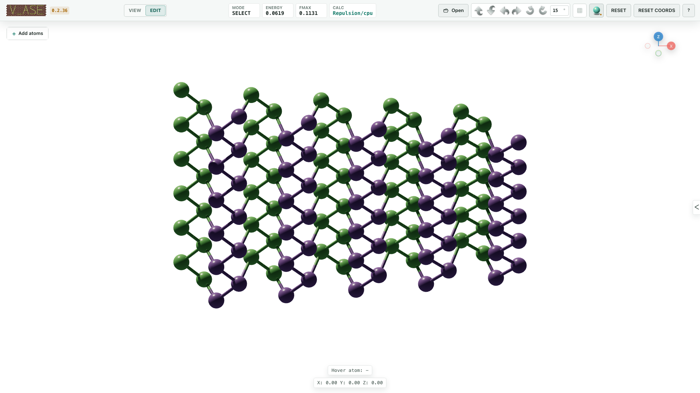

```{vase-demo} logo
:alt: Interactive v_ase atom logo
:fallback: assets/v_ase-logo.png
:height: 360
:caption: The logo is a real atomistic scene. Drag it to rotate the structure.
```

# v_ase documentation

v_ase is a local, browser-based viewer, editor, and analysis workspace for
[Atomic Simulation Environment (ASE)](https://ase-lib.org/) structures,
trajectories, and volumetric fields. It combines terminal and Python entry
points with a direct 3D editor, scientific analysis, reproducible rendering,
portable projects, and an exact semantic interface for external AI agents.

:::{admonition} Current release
:class: note
This manual describes **v_ase 0.2.36**. Behavior is documented from the source,
live semantic schema, and regression suite in this release rather than from a
future roadmap.
:::

## Start here

Install and open a structure:

```bash
python -m pip install v_ase-gui
v_ase gui POSCAR
```

Or launch from Python:

```python
from ase.build import molecule
from v_ase import view

view(molecule("H2O"))
```

The default file workflow starts in lightweight **View** mode. Switch to
**Edit** when coordinates, topology, constraints, or relaxation must change.
Running `v_ase gui` without a file opens an empty editable document.

## What v_ase covers

| Area | Included workflows |
| --- | --- |
| Inspect | Large structures, lazy trajectories, labels and ASE arrays, ordered measurements, supercell replicas |
| Edit | Exact move/rotate/scale, add atoms and molecules, ASE bulk building, copy/paste, constraints, undo/redo |
| Analyze | Displacement, stored forces, periodic RDF, finite pair distributions, registry maps and relaxation |
| Fields | VASP density/potential/ELF, Gaussian Cube and XSF, combinations, slices, isosurfaces, repetition |
| Interfaces | Local CLI, Python API, Jupyter display, one-command SSH remote use, multi-document workspaces |
| Output | Structures, `.vase`, project HTML, view-only HTML, images, video, Blender, OBJ, and optional Rhino 3DM |
| Collaboration | Revisioned semantic state and commands shared by the live GUI, terminal automation, and external AI agents |



## Choose a path

- [Start](start.md) with installation, a first session, and the workspace model.
- Follow a task under [Workflows](workflows.md) to edit, analyze, style, or export.
- Use [Automation and APIs](automation.md) for Python, notebooks, CLI, remote, or AI work.
- Open [Reference](reference.md) for formats, shortcuts, troubleshooting, and development.

```{toctree}
:maxdepth: 2
:hidden:

start
workflows
automation
reference
```

## Project links

- [Source repository](https://github.com/lgyEthan/v_ase)
- [PyPI package](https://pypi.org/project/v-ase-gui/)
- [Issue tracker](https://github.com/lgyEthan/v_ase/issues)
- [License](https://github.com/lgyEthan/v_ase/blob/main/LICENSE)
