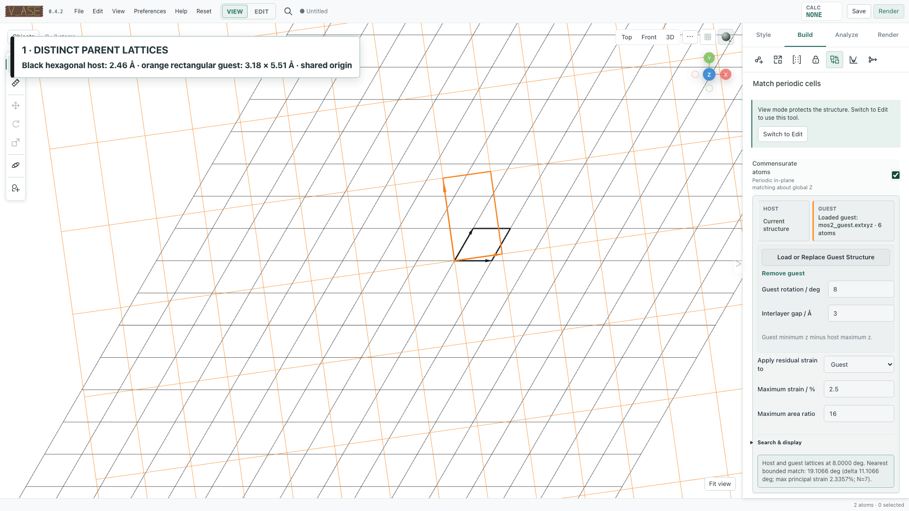
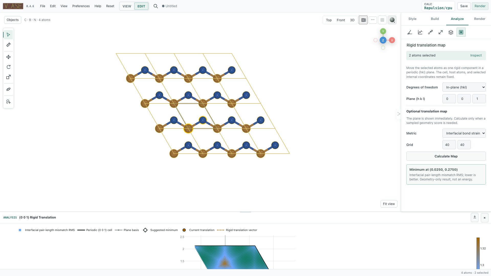

# Periodic cells and interfaces

v_ase distinguishes display replication, physical supercell construction,
bounded commensurate-cell matching, and rigid registry analysis. They solve
different problems and should not be substituted for one another.

## Cell and periodic boundary conditions

Under **Structure > Cell & Replication**, edit the complete 3×3 cell and the
three PBC flags. Setting a cell does not scale Cartesian atom coordinates. Wrap
maps atoms into periodic directions of their own current frame.

For a trajectory-wide physical operation, every frame is validated and uses
its own cell and PBC. The active frame's lattice is never copied onto the other
frames as a shortcut.

## Displayed and physical supercells

### Display replication

The displayed supercell repeats visual instances for inspection, measurement,
styling, and composition. It is saved as a display setting. In View, replicas
can be selected and hidden independently. In Edit, replica selection resolves
to the unique base atom.

Display replication does **not** change `len(atoms)`, coordinates, constraints,
or the exported physical structure.

### Physical supercell

Use the physical replication/commit action when the ASE object must contain the
repeated atoms. Diagonal repetitions and general integer 3×3 supercell matrices
are validated against cell rank, atom-count limits, arrays, labels, and
supported constraints. This is a topology-changing Edit operation and is added
to history.

## Visual and physical translation

- Visual translation changes only where the rendered scene appears. It can be
  Cartesian or fractional and is stored with display settings.
- Physical `translate-all` changes ASE coordinates on every applicable frame
  without changing the cell. Fractional vectors use the full non-orthogonal
  cell matrix.

Use visual translation for composition/alignment and physical translation when
the saved coordinates themselves must move.

## Commensurate same-lattice rotation

The commensurate workspace searches bounded integer cell-boundary matches. It
can guide a rotation, preview a common cell, and materialize the selected
candidate. Search limits include integer index/area bounds and strain tolerance;
results are deterministic for the same inputs.

The guide is disabled by default. When enabled, it searches and displays
candidate angles, matrices, area ratios, cell geometry, and residual strain.
Magnetic snapping is a separate opt-in behavior.

This is a lattice matching operation, not an electronic-energy or adsorption
site search. Candidate strain values describe the selected cell mapping and
target convention.

## Separate host and guest lattices

Host/guest mode loads a second structure, projects both periodic lattices into
a compatible plane, and searches a common two-dimensional cell. A candidate
contains separate host and guest integer matrices, relative rotation, area
ratio, residual strain, and preview geometry.

Before applying:

1. Confirm the periodic plane and global axis convention.
2. Inspect both cell matrices and atom counts.
3. Choose the intended strain target rather than assuming one component is
   rigid.
4. Inspect boundary atoms/constraints in the preview.
5. Materialize only after the common-cell result is acceptable.

The detailed mathematics, notation, and reference series are in
[Cell-aware rotation and commensurate angle guide](unit_cell_aware_rotate.md).
Numerical fixtures and search bounds are documented in
[Commensurate scientific validation](commensurate_validation.md).

## Registry maps

Registry analysis translates one rigid selected component over a periodic
`(hkl)` plane and evaluates a geometric metric on a bounded 2D grid. Available
metrics include current short-contact and bond-strain screens. The result keeps
the exact plane basis and Cartesian translations so a point can be reproduced
or exported to CSV.

These maps are geometric screens, not potential-energy surfaces. Their meaning
depends on the selected component, plane, pair cutoffs, reference bonds, and
grid resolution.

## Rigid registry relaxation

After choosing the moving component, v_ase can optimize one shared rigid
translation in either:

- a compatible periodic `(hkl)` plane; or
- bounded Cartesian x/y/z translation.

All selected atoms preserve internal geometry. The optimization timeline can
be scrubbed before Finish or Cancel. Plane and Cartesian modes have explicit
bounds; invariant-geometry and finite-difference checks protect the rigid
contract.

Use **Finish** to commit the selected result. **Cancel** restores the exact
pre-workflow structure. Stopping leaves the workspace and current result open
for inspection.

## Measurement across replicas

For two displayed atoms, v_ase reports the direct displayed distance and the
minimum-image distance when defined. If a replica is involved, it can also show
the distance after both atoms are mapped into the original unit cell. Angles
and torsions use the displayed Cartesian coordinates only.

This keeps the meaning of a clicked periodic image explicit instead of silently
replacing it with the nearest base atom.

## Export and verification

- `commensurate-csv` exports candidates, integer matrices, area ratios,
  strains, and search references.
- `registry-csv` exports the complete grid, lattice basis, Cartesian vectors,
  and metric values.
- Project/HTML output preserves the current preview and visual state as
  supported.

After materializing a cell, verify atom count, cell vectors, PBC, constraints,
and boundary continuity in the exact saved structure—not only in the preview.
