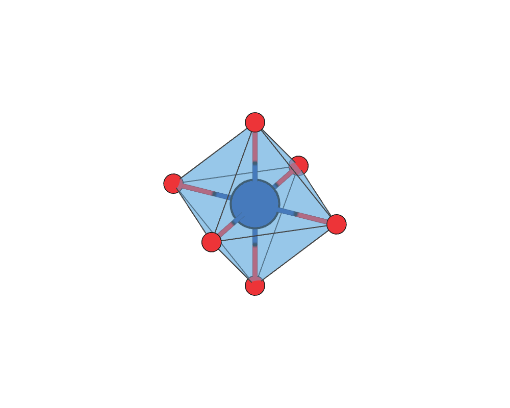
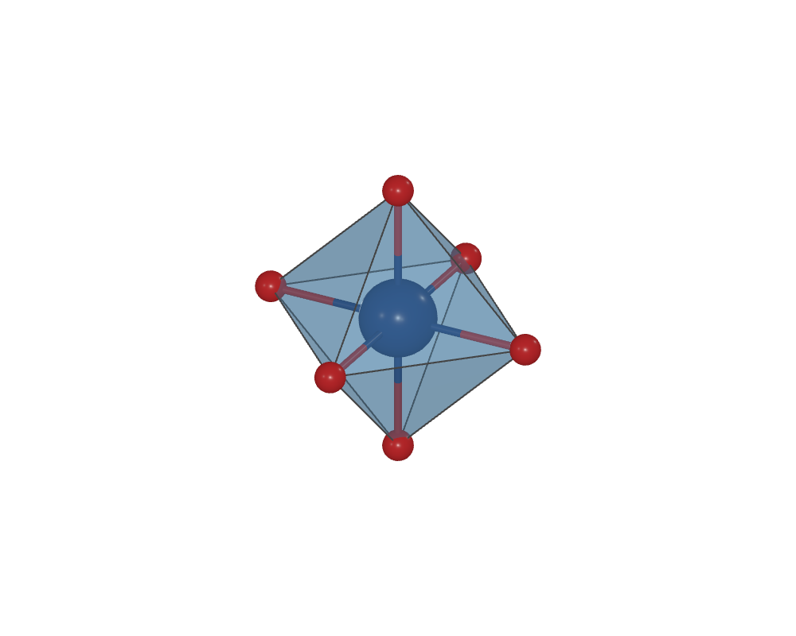
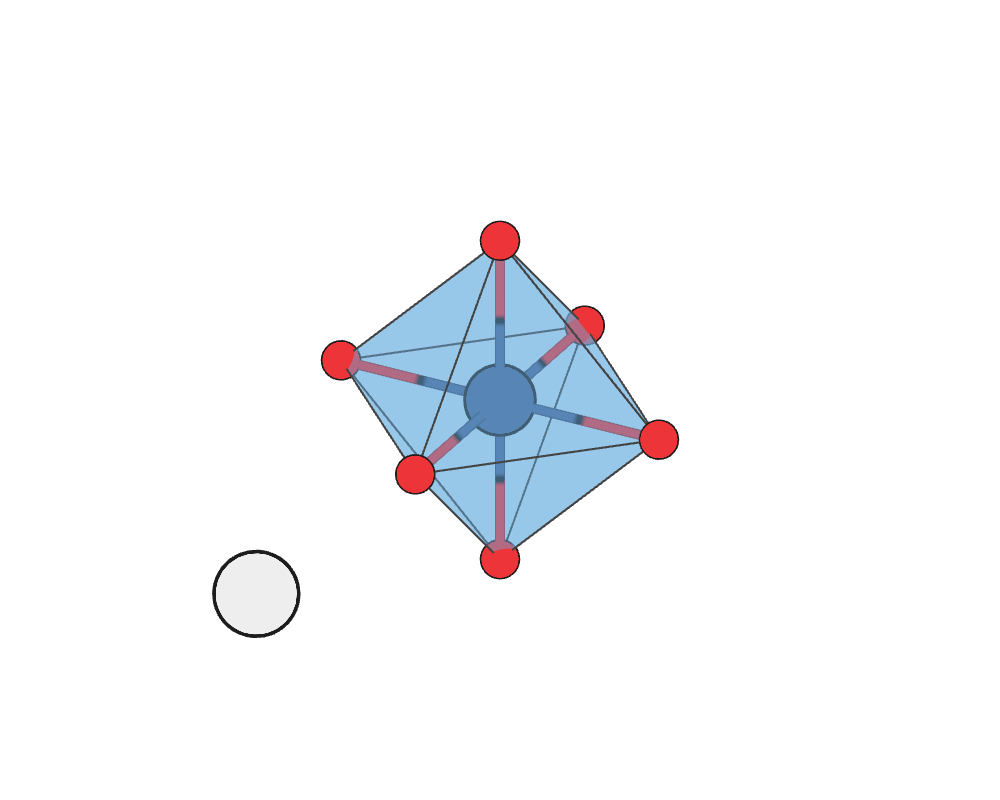
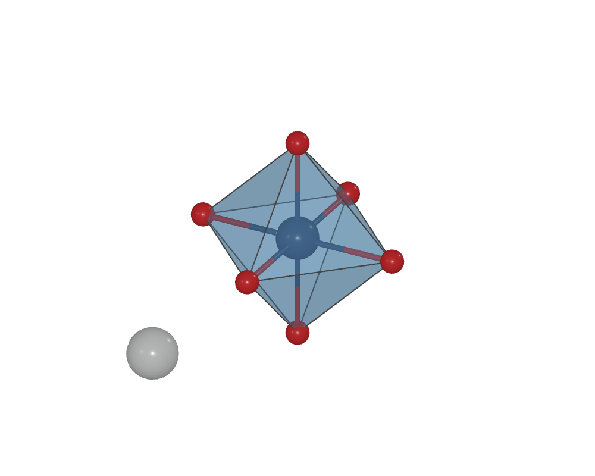
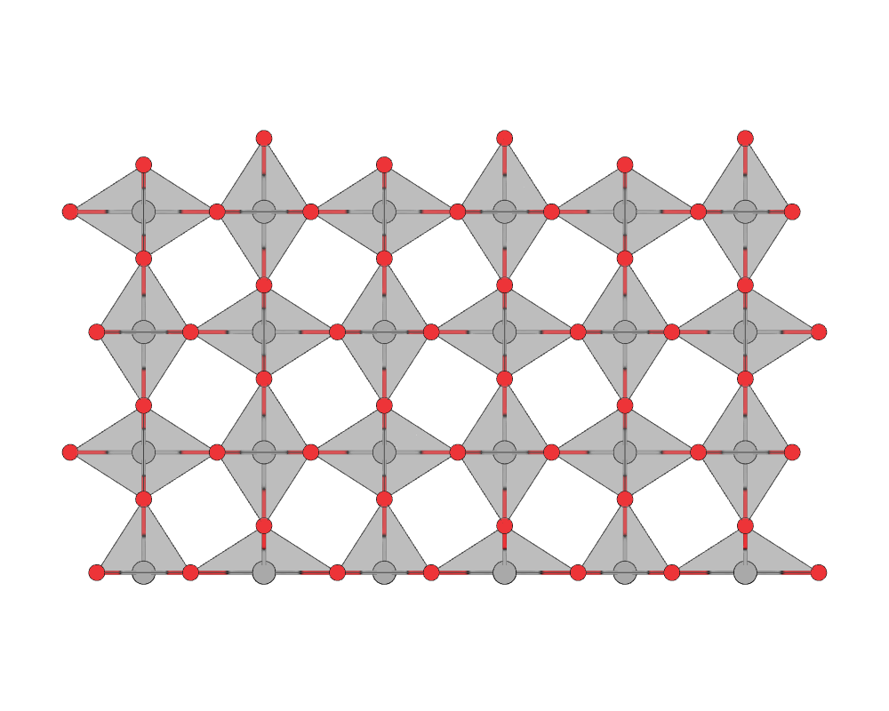
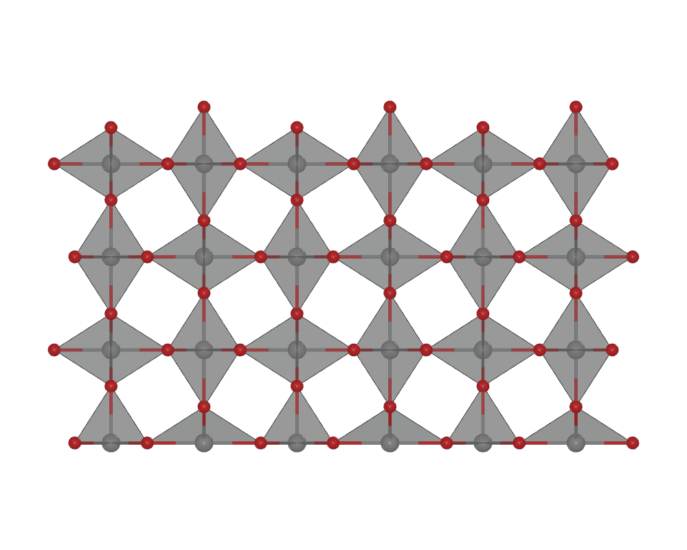
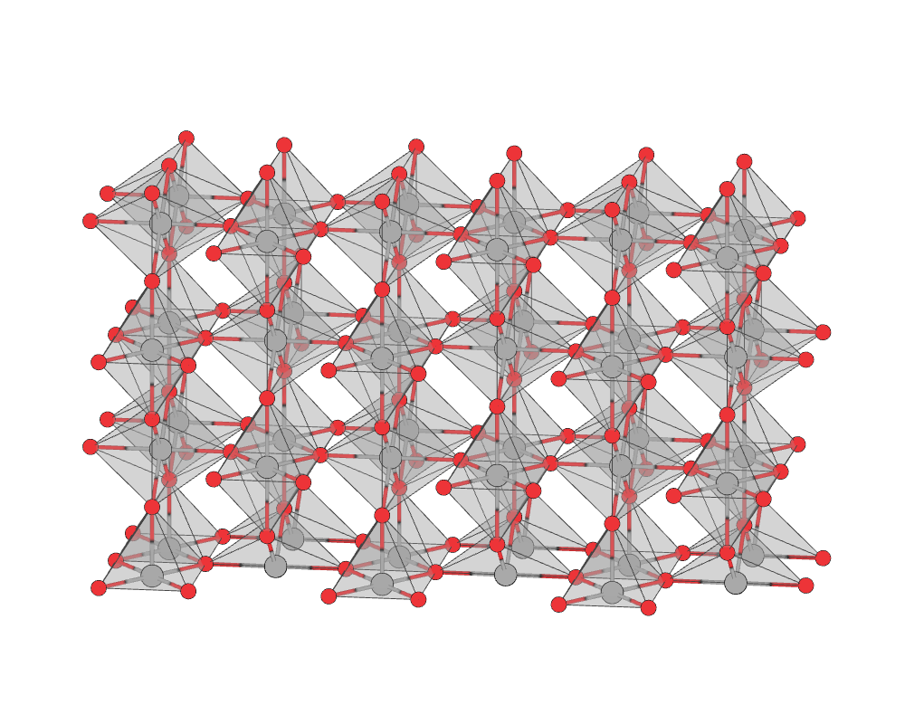
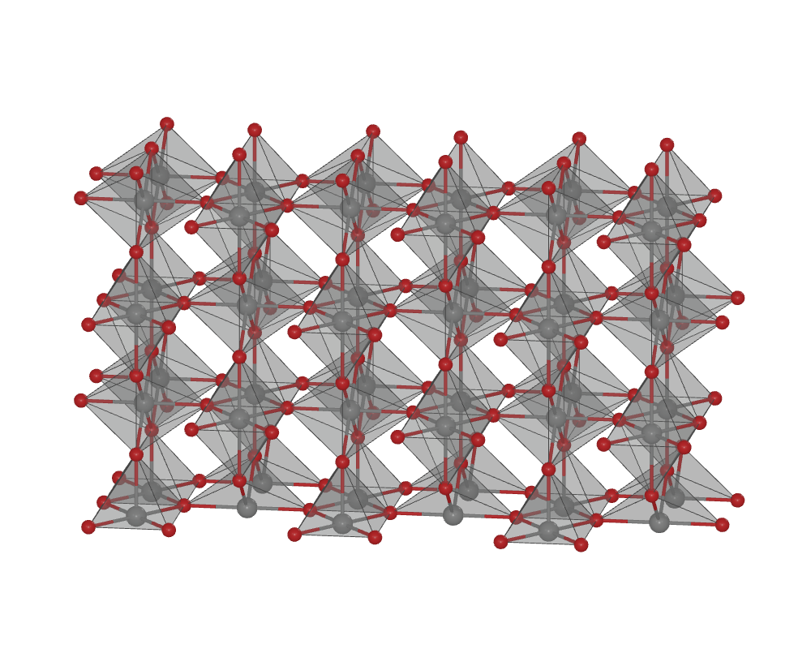

# Coordination polyhedra

Show the coordination around chosen atoms as colored faces and edges. Use it
for perovskites, oxides, mixed ligands or distorted local environments.
**View mode is sufficient:** the feature changes no coordinates and runs no calculator.

**Open:** **Structure > Coordination Polyhedra**. Add a rule, choose its centers
and surrounding atoms, set a cutoff, then click **Apply polyhedra**.

The same coordination geometry works in **2D** (flat colors and outlined atoms)
and **3D** (lit surfaces and spheres). These are display styles: 2D does not
flatten atom coordinates or replace an octahedron with a planar polygon.

## What you control

| Control | Meaning |
| --- | --- |
| Centers by Element / Visual label / Atom index | Which atoms own a polyhedron |
| Surrounding atoms by Element / Label / Index | Which atoms may become its vertices |
| Minimum / maximum distance | Distances in Å from each center; independent of visible bonds |
| Coordination range | Show only neighborhoods within the chosen count range |
| Include periodic images | Honor the input PBC flags and include all qualifying images |
| Face color / Use center atom color | A custom rule color or the resolved center's color |
| Face opacity | 0 hides faces; 1 makes them opaque; intermediate values are transparent |
| Show edges / Edge color / Edge radius | Independent outlines; radius is in Å |
| Atoms with polyhedra | All atoms / Centers and ligands / Center atoms / Ligand atoms / Hide atoms |
| Complete periodic ligand atoms | Show the ligand image spheres needed outside the displayed cells |
| Center–ligand connectors | Draw center-to-ligand spokes independently of ordinary bonds |
| Respect hidden centers | Follow hidden center labels and individual references |

Colors and opacity apply **independently to each rule**. After a rule exists,
changing its appearance updates the figure immediately without another neighbor
search. Choosing a custom color turns off center-color inheritance.
Faces at opacity zero can retain visible edges for a wireframe view.

Rules are additive. Use disjoint groups when different sites should have different
styles. For a local color exception, inherit center colors and use the existing
[per-atom appearance controls](appearance.md#per-atom-overrides). Atom, ligand and
polyhedron visibility remain separate: hiding oxygen spheres does not remove the
oxygen vertices of a coordination polyhedron.

## Example: one octahedron in 2D and 3D

Download {download}`NbO6_fragment.extxyz <assets/examples/NbO6_fragment.extxyz>`.
This is an **unrelaxed seven-site coordination example**, not an isolated stable
molecule or an oxidation-state assignment. Every Nb–O distance is 2 Å.

```bash
v_ase gui NbO6_fragment.extxyz
```

1. In **Structure > Coordination Polyhedra**, add a rule with center **Nb**,
   ligand **O**, maximum distance **2.3 Å** and coordination range **6–6**.
2. Choose face color **#6aafe0**, opacity **0.45**, edge color **#444444** and
   edge radius **0.012 Å**. Apply the rule.
3. Set **Atoms with polyhedra > Centers and ligands** and enable
   **Center–ligand connectors**. The six oxygen spheres, central Nb sphere,
   twelve edges and six spokes should all remain visible through the faces.
4. Under [atom appearance](appearance.md), use Nb **#284f9e**, radius **0.55 Å**;
   O **#ed3438**, radius **0.22 Å**, with radius scale **1**. Set bond width to
   **0.11 Å**. The connectors follow the existing bond colors and widths.
5. Use [middle-mouse orbit](camera.md) to expose all six oxygen vertices, then fit.
   Switch atom display style between **2D** and **3D** without changing the pose.
   The recorded view uses a target-to-camera direction of **[8, −15, 9]**, **+Z up**;
   this vector can also be supplied through the native camera tool.

| 2D: flat colors | 3D: surface lighting |
| --- | --- |
|  |  |

The illustrations use orthographic projection. Perspective projection also works.
In 2D, connectors use unlit colors, so a material requiring lights cannot turn
them black. Their configured 3D material remains available when switching back.

## Example: a periodic cell with complete ligand spheres

Open the {download}`five-atom SrTiO3 cell <assets/examples/SrTiO3_primitive.traj>`.
Add a **Ti / O / 2.2 Å** rule, set **All atoms**, and keep
**Complete periodic ligand atoms** enabled. Enable center–ligand connectors.
Use the same view as above, with Ti radius **0.40 Å** and Sr radius **0.48 Å**.

| 2D | 3D |
| --- | --- |
|  |  |

There are **five physical atoms**, but **eight displayed sites**: Sr, Ti and six
oxygen images. The three added image spheres share base atom identities with
oxygen already in the file. Turning completion off hides these extra spheres;
the polyhedron still has six vertices. Shared image sites are drawn once, even
when several neighboring polyhedra use them.

Click or box-select an image sphere in **View** to retain its base index and
cell offset. In **Edit**, selection maps to the original editable base atom. Saving a structure does not
append these display-only images to the atom list.

## Example: rutile IrO2 (110) surface

Download {download}`IrO2_110_polyhedra.extxyz <assets/examples/IrO2_110_polyhedra.extxyz>`.
This illustrative slab has **144 physical atoms**, **48 Ir centers**, in-plane
periodicity and a finite surface-normal direction. It is cut from the bulk model
specified below; it is not a relaxed surface calculation.

1. Add an **Ir / O / 2.4 Å** rule. Keep the default coordination range so actual
   undercoordinated surface sites can appear. A **6–6** filter would omit them.
2. Use face **#a4a4a4 / 0.28**, edge **#444444 / 0.012 Å**, Ir spheres
   **#a9a9a9 / 0.32 Å**, and O spheres **#ed3438 / 0.22 Å** (radius scale **1**).
3. Keep all atoms, periodic ligand completion and center–ligand connectors on.
   Hide the cell, axes and grid for these figures.
4. Press **Y** (again to flip sides if needed) for the side view, then fit.
   Orbit slightly for the oblique view and switch 2D/3D to compare. The recorded
   target-to-camera directions are **[0, −1, 0]** and **[3, −20, 5]**, both **+Z up**.

| Side view · 2D | Side view · 3D |
| --- | --- |
|  |  |

| Oblique view · 2D | Oblique view · 3D |
| --- | --- |
|  |  |

These settings produce **48 hulls and 270 center–ligand connectors**. Periodic
completion adds 53 visible ligand images. Missing surface ligands remain missing;
the visualizer does not close the vacuum direction or invent oxygen atoms.

## Example: two colors in rutile IrO2

Download {download}`IrO2_polyhedra.extxyz <assets/examples/IrO2_polyhedra.extxyz>`.
This 72-atom example contains 24 Ir centers. The supplied `Ir_A` and `Ir_B` labels
distinguish the two symmetry-related basis-site groups; both are chemically **Ir**.
They do not label different oxidation states.

```bash
v_ase gui IrO2_polyhedra.extxyz
```

### 1. Define the first center group

1. Open **Structure > Coordination Polyhedra** and click **Add rule**.
2. Set **Centers by > Visual label** and enter `Ir_A`.
3. Leave surrounding atoms set to **Element**, `O`.
4. Set maximum distance to **2.4 Å**, and minimum/maximum coordination to **6 / 6**.
5. Keep periodic images enabled. Choose face color **#329eb5**, opacity **0.38**,
   edge color **#235866**, and edge radius **0.022 Å**. Click **Apply polyhedra**.

The result is twelve distorted IrO6 octahedra. The vertices are the actual oxygen
positions; no ideal octahedron is fitted to them.

### 2. Add the second group

Click **Add rule** again. Use these settings and apply:

| Setting | Second rule |
| --- | --- |
| Center selector | Visual label `Ir_B` |
| Ligands | Element `O` |
| Maximum distance | 2.4 Å |
| Coordination range | 6–6 |
| Face color / opacity | **#e29c45 / 0.25** |
| Edge color / radius | **#78552c / 0.022 Å** |

Now there are **24 polyhedra**. Choose **Centers and ligands** to expose the network,
then **Fit polyhedra in view**. The two rules keep separate colors and opacities.

```{figure} assets/readme_polyhedra.png
:alt: Two supplied Ir basis-site groups shown with different face colors and opacities.

Ir_A is teal and Ir_B is amber. The gold box is the cell; complete coordination
can extend beyond it when the center is inside.
```

### 3. Adjust transparency without changing the structure

Select the `Ir_A` rule. Change **Face opacity** from 0.10 to 0.75, then return to
0.38. The amber group's opacity stays 0.25; atom coordinates and vertex membership
are unchanged. The GIF records these GUI changes.

```{vase-animation} assets/readme_polyhedra.gif
:alt: Changing the teal Ir_A face opacity while the amber Ir_B rule stays unchanged.
:fallback: assets/readme_polyhedra.png
```

Click a visible face to select its center atom; Shift-click toggles the selection.
Amber edges identify selected polyhedra, including with atoms hidden.
Publication image export suppresses this temporary highlight.

Save a [project](save-projects.md) to retain both rules and the view. Use
[image export](render-images.md) for a figure at exact pixel dimensions.

## Example: corner-sharing TiO6 in SrTiO3

Download {download}`SrTiO3_polyhedra.traj <assets/examples/SrTiO3_polyhedra.traj>`.
This 90-atom model contains eighteen Ti centers.

1. Open it in View and add a polyhedra rule.
2. Choose centers by **Element: Ti**, surrounding atoms by **Element: O**,
   and a maximum distance of **2.2 Å**.
3. Set face color **#547eb5**, opacity **0.35**, edge color **#29466e**, and
   edge radius **0.022 Å**.
4. Choose **Centers and ligands** and fit the view. There should be **18 polyhedra**.

```{figure} assets/readme_polyhedra_srtio3.png
:alt: Eighteen corner-sharing TiO6 polyhedra in an idealized cubic SrTiO3 model.

Each TiO6 has six ligand images, eight triangular faces and twelve edges.
A single five-atom primitive cell also gives six oxygen vertices, although it
contains only three oxygen basis atoms.
```

The supplied bulk inputs are explicit, **unrelaxed illustrative models**. SrTiO3 uses
`a = 3.905 Å`; rutile IrO2 uses `a = 4.505 Å`, `c = 3.159 Å`, `u = 0.305` and
space group 136. They are reproducible geometry examples, not experimental
refinements or calculated equilibrium structures. The chosen cutoffs are example
settings, not universal chemical bond definitions.

## Mixed, incomplete and planar coordination

Enter several ligand elements separated by commas, such as `O, N, F`, or use
known labels/indices. A selector value of `*` means all atoms. Different rules
can use different cutoffs and coordination ranges in one document.

For a surface or oxygen vacancy, use the actual PBC flags and inspect the
coordination count. A finite direction is never made periodic by the checkbox.
A missing ligand remains missing. Lower the coordination range if the resulting
incomplete environment is part of the figure, or keep 6–6 to show only six-site
neighborhoods.

**Allow planar coordination** draws a polygon when the selected ligand positions
are planar. Its reported volume is zero. Collinear or numerically degenerate
neighborhoods are reported rather than turned into an invented solid.

## Exact vertices for a special site

Download the {download}`five-atom SrTiO3 cell <assets/examples/SrTiO3_primitive.traj>` for this exercise.

Use **Exact periodic vertices** when the intended coordination cannot be selected
by one cutoff. Select **one center by atom index**, then enter one vertex per line:

```text
2 0 0 0
2 0 0 1
3 0 0 0
3 0 1 0
4 0 0 0
4 1 0 0
```

Each line is `atom_index shift_x shift_y shift_z`. Indices are zero-based. The
last three integers multiply the original lattice vectors. These six records
illustrate the oxygen vertices around Ti **#1 in a five-atom primitive SrTiO3
cell**; they are not the indices of every polyhedron in the larger download.

Explicit vertices override the distance search. They must still match the ligand
selector and allowed PBC directions. Leaving the text box empty restores cutoff
selection. MCP additionally supports several explicit center groups in one rule.

## What the geometry means

The surface is the **convex hull of the selected ligand positions**. This follows
the center/ligand/range idea used in [VESTA's coordination display](https://jp-minerals.org/vesta/en/doc/VESTAch8.html).
It is not a charge-density boundary, an inferred oxidation state or an energy model.
A convex hull does not describe a concave cavity.

- Periodic vertices retain both their base index and integer cell offset.
- Coincident vertex positions are collapsed for geometry and reported. This is
  not an occupancy model. A ligand coinciding with its center requires a corrected
  selection or positive minimum distance.
- Interior ligand sites can make the neighbor count larger than the number of
  hull vertices. Inspect both when that distinction matters.
- Coplanar facets share one face boundary; triangulation diagonals are not drawn
  as edges. Area and volume are in Ų and ų. Inside includes the boundary within
  the reported numerical tolerance.
- The numerical rank tolerance is reported. Coordinates are never joggled to
  manufacture volume. Hull construction uses [SciPy/Qhull](https://docs.scipy.org/doc/scipy/reference/generated/scipy.spatial.ConvexHull.html).

## Transparency and overlap

Face opacity belongs to each rule. It does not change the oxygen or center atom's
opacity. Use the atom appearance controls separately when those spheres should
also be translucent.

Intersecting transparent polyhedron faces are split for drawing and ordered
back-to-front for the current camera. This applies across rules in 2D/3D and
orthographic/perspective views; camera rotation cannot reuse an old face order.
Opaque atoms and connectors participate in depth testing. Scientific vertices,
face boundaries, coordination counts and volumes are unchanged by drawing splits.

This ordering covers polyhedron faces. Separate translucent objects, such as a
translucent sphere or annotation plane crossing a face, still use the renderer's
object ordering and can show overlap artifacts. Keep atom/connector opacity at
1 when exact face-through-atom depth is required. Exact PNG export uses the same
view renderer; editable CAD/Blender output follows the destination renderer.

## MCP and saved output

Use `vase_configure_polyhedra` to define rules. For an appearance-only change,
use **`vase_style_polyhedra`** with existing `rule_ids`, `color` and/or `opacity`;
it preserves selectors and all other rules. A null color restores center-color
inheritance. Read the current document ID and revision before mutations.

`vase_scene_snapshot(sections=["polyhedra"], limit=4)` reports resolved appearance,
world/screen positions, exact site-image identities, faces, edges and geometry
metrics. Pages keep whole hulls and return at most 512 vertices; use the returned
next offset and scene fingerprint. Include `atoms` and `bonds` to inspect visible
ligand images and center–ligand connectors. Their `source` fields identify them
without changing the document's physical atom count. The native configuration
options are `atom_mode`, `complete_ligands` and `show_center_bonds`.
See [native tool setup](ai-tools.md).

Rules survive `.vase` and presets. Image/video capture waits for current geometry;
trajectory playback updates hulls per frame, and video export waits for the
geometry of each source or interpolated frame. Offline HTML embeds each frame's
hulls and needs no server. OBJ, Blender and optional 3DM preserve faces, edges,
colors, opacity, completed ligand sites and connectors; Blender export also
updates these together across saved frames.
Structure-only formats such as CIF or POSCAR contain atoms, not these display rules.

The implementation bounds center count (5,000), output vertices (100,000),
candidate neighbors per center (512) and periodic query work. Display repetition
also has an edge/triangle budget; transparent face splitting is bounded at
120,000 polygons and a tree depth of 128. A limit produces a clear error rather than a
silently truncated polyhedron. Reduce centers, cutoff or repetitions when needed;
large changing neighborhoods can reduce trajectory playback speed.
