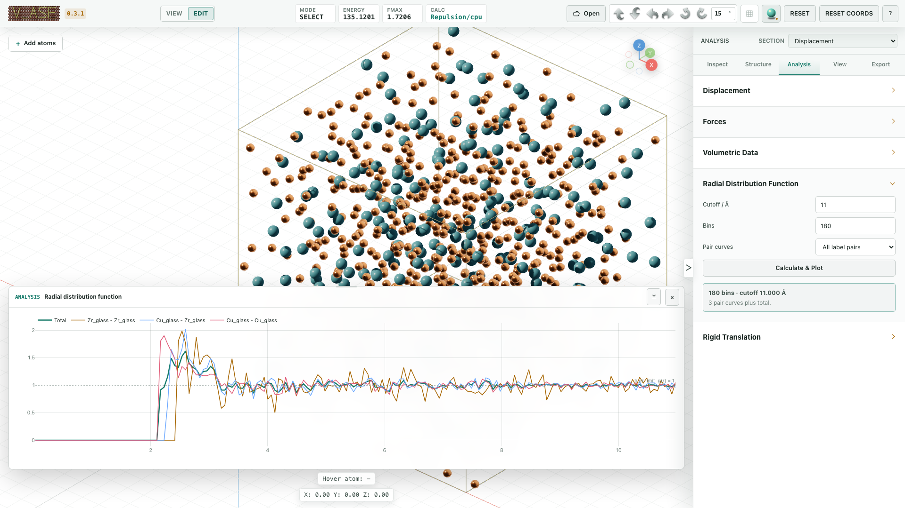

# Radial and finite pair distributions

Use pair statistics to inspect local spacing, coordination shells, and chemical
ordering. Open **Analysis > Radial / Pair Distribution** after loading a structure
or selecting a trajectory frame.

```{contents} On this page
:local:
:depth: 1
```

## Choose the correct quantity

| Boundary conditions | Reported quantity | Meaning |
| --- | --- | --- |
| Periodic in all three axes | Bulk `g(r)`, dimensionless | Pair density divided by uniform bulk density |
| No periodic axes | Finite pair probability density, Å⁻¹ | Probability of an unordered pair distance in each radial interval |
| Some periodic axes | Explicit error | A slab or wire needs a geometry-specific boundary correction |

Vacuum in a fully periodic slab still contributes to the cell volume. Enabling
all PBC flags does not turn a slab into homogeneous bulk: its `g(r)` normalization
will depend on that vacuum. Do not change PBC just to bypass the partial-PBC error.

## Calculate and interpret a plot

1. Select the intended frame. The plot uses the full physical structure, even
   when only some atoms are selected or a display supercell is visible.
2. Set a positive **Cutoff / Å** and an integer number of **Bins** from 8 to 5000.
3. Choose **Total only**, **All label pairs**, or the active/selected bond-pair filter.
4. Click **Calculate & Plot**. Verify the title, units, cutoff, and frame.
5. Export CSV to save the actual plotted total and partial curves.

The histogram includes distances on its final edge within floating-point
tolerance. For periodic data, the search includes every image inside the
requested sphere, including nonzero images of the same basis atom. A large
cutoff is allowed and does not depend on displayed replication, but it samples
repeated copies of this finite configuration rather than independent data.

The automatic cutoff is half the smallest cell-face height, a conservative
unique-image reference. Increasing the bin count sharpens radial resolution
while increasing noise. This is an instantaneous frame statistic; obtain an
ensemble or time average separately if that is the desired observable.



## Normalization and partial curves

For a periodic cell of volume `V` with `N` atoms, bin edges `a,b`, and directed
neighbor count `H`, the total uses the exact shell volume:

```text
shell = 4π/3 × (b³ − a³)
g(r) = H / [(N²/V) × shell]
g(r) = Σα cα² gαα(r) + 2 Σα<β cα cβ gαβ(r)
```

`cα = Nα/N`. Same-label partials use `Nα²/V`, and mixed partials combine both
directions and use `2NαNβ/V`. Thus concentration weighting reconstructs the
total. Selected/active modes choose which label-pair curves appear; they do not
restrict the population used for normalization.

For an independent finite-N periodic random configuration below the unique-image
cutoff, the expected total is `(N−1)/N`, approaching one for large N. The dotted
one-line is a bulk reference, not a promise that every finite curve reaches one.

For a finite structure, each unordered pair is counted once and divided by
`N(N−1)/2` and bin width. The integral is one only when the cutoff includes all
pairs. Same-label partials use `Nα(Nα−1)/2`; a singleton label has a zero curve.

## Compute and export in Python

This example creates an ideal random periodic reference and writes an RDF CSV.
The returned `radius`, `total`, and `partial` arrays contain the plotted data.

```python
from pathlib import Path
import numpy as np
from ase import Atoms
from v_ase.analysis import calculate_rdf, rdf_csv

rng = np.random.default_rng(7)
atoms = Atoms("Ar1000", scaled_positions=rng.random((1000, 3)), cell=[25]*3, pbc=True)
result = calculate_rdf(atoms, cutoff=8.0, bins=100, pair_mode="all")
Path("argon-rdf.csv").write_bytes(rdf_csv(result))
print(result.title, result.y_label, result.cutoff)
```

For a molecule, read it with ASE and leave its PBC false. The same function
returns a finite pair distribution with the corresponding CSV column title.

## Common interpretation mistakes

A visual bond cutoff is not an RDF distance cutoff. Displayed replicas do not
add independent samples. A smooth homogeneous placement is correlated and
should not be used as an ideal-gas normalization reference. A low repulsive
energy does not establish chemical order or physical stability.

See [trajectories](trajectories-analysis.md) for frame synchronization and
[scientific validation](scientific-validation.md) for the enumeration and
normalization regressions.
