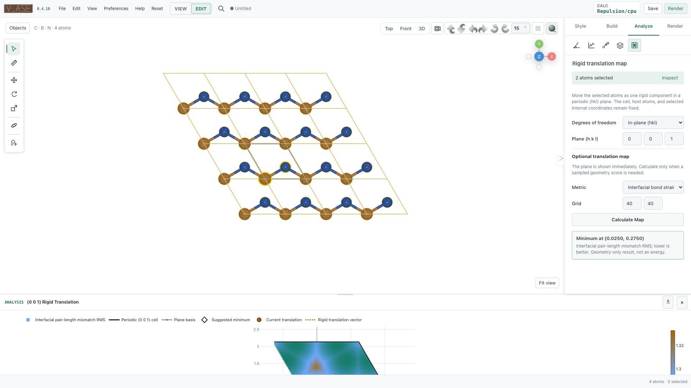

# Registry maps and rigid translation

Explore lateral alignment between a known selected fragment and its host.
Open **Analyze → Registry map** for mapping or **Build → Rigid translation** for movement. A map
samples translations; rigid relaxation searches translations without changing
internal fragment geometry.

## Translate coordinates without relaxation

In **Edit**, open **Build → Rigid translation → Translate coordinates**.
**Build → Transform cell → Translate coordinates…** opens the same controls.
Choose **All atoms** or **Selected atoms**, **Cartesian / Å** or **Fractional / a,b,c**,
and **Current frame** or **All frames**, enter three offsets, then click
**Translate coordinates**. Fractional offsets are multiplied by each frame's
own full cell matrix; no unit cell is required for Cartesian offsets.

This is a physical rigid shift. It retains the cell, arrays, labels and stored
constraints, but deliberately does not project the offset through those
constraints or start an optimizer. Use constrained `G` movement or the optional
workflow below when motion must obey individual positional constraints.
Undo/Redo covers the chosen frames. For composition only, use **Style → Cell →
Translate atoms**, which leaves ASE coordinates unchanged.

## Optional constrained translation and relaxation

Under **Build → Rigid translation**, expand **Optional constrained translation &
relaxation** for the existing planar/Cartesian registry workflow. Maps live
under **Analyze → Registry map**. Ordinary coordinate translation above never
activates this optimizer.

## Registry maps

Registry analysis translates one rigid selected component over a periodic
`(hkl)` plane and evaluates a geometric metric on a bounded 2D grid. Available
metrics include current short-contact and bond-strain screens. The result keeps
the exact plane basis and Cartesian translations so a point can be reproduced
or exported to CSV.

These maps are geometric screens, not potential-energy surfaces. Their meaning
depends on the selected component, plane, pair cutoffs, reference bonds, and
grid resolution.

## Rigid registry relaxation

After choosing the moving component, v_ase can optimize one shared rigid
translation in either:

- a compatible periodic `(hkl)` plane; or
- bounded Cartesian x/y/z translation.

All selected atoms preserve internal geometry. The optimization timeline can
be scrubbed before Finish or Cancel. Plane and Cartesian modes have explicit
bounds; invariant-geometry and finite-difference checks protect the rigid
contract.

Use **Finish** to commit the selected result. **Cancel** restores the exact
pre-workflow structure. Stopping leaves the workspace and current result open
for inspection.



## Example: translate a known bilayer fragment

Download {download}`graphene_hbn_commensurate.traj <assets/examples/graphene_hbn_commensurate.traj>`. Open in Edit and select
the upper hBN layer (all B and N atoms), leaving the C host unselected.

1. Choose a 2D periodic translation plane and a sampling resolution in the registry panel.
2. Choose **Short-contact score** or **Interfacial bond strain** for the optional
   map. These are geometric scores, not calculated binding energies.
3. Run the map and compare the current and lowest sampled translations.
4. Apply a chosen translation and confirm that intralayer distances are unchanged.
5. Alternatively start rigid translation relaxation, inspect its own timeline,
   and explicitly keep or restore the resulting translation.

```{vase-animation} assets/readme_registry_relax.gif
:alt: The existing rigid-translation demonstration explores registry without deforming the fragment.
:fallback: assets/readme_registry_map.png

The existing rigid-translation demonstration explores registry without deforming the fragment.
```

A discrete map minimum is only the best sampled translation for that objective.
See [relaxation](relaxation.md) for the distinction from unconstrained atom motion.
