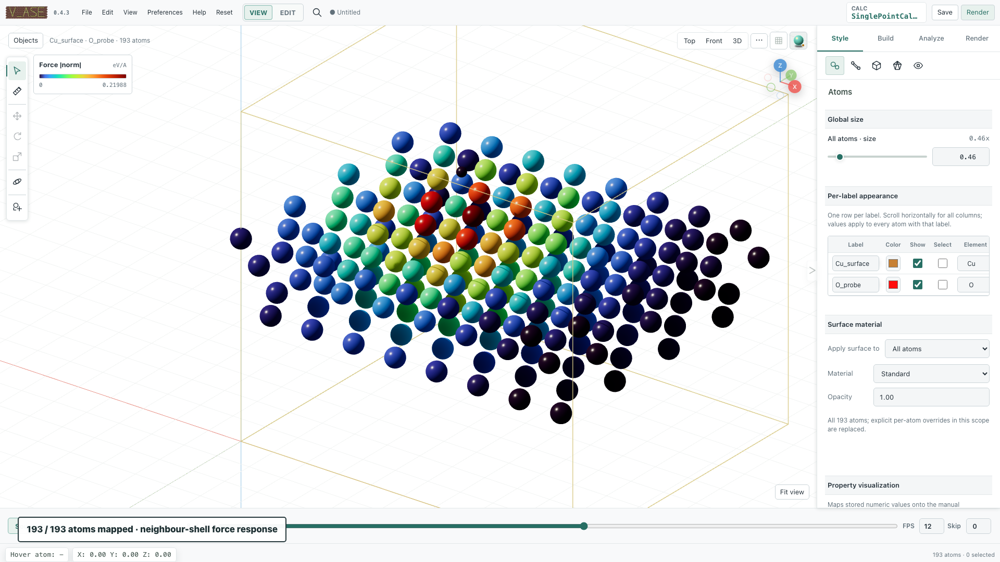

# Color atoms by a scalar property

Map height, force magnitude or another stored per-atom array to color.
Use **Style > Atoms > Atom Colorscale**. Fix a common range when comparing frames
so a given color keeps the same numerical meaning.


## Example: compare stored Cu forces across frames

Download {download}`stored-forces.traj <assets/examples/stored-forces.traj>`. Open it with **File > Open**, or run this in the folder containing the download:

```bash
v_ase gui stored-forces.traj
```

1. Choose force magnitude as the scalar and scope **All atoms**.
2. Choose **turbo**, gamma **0.72**. The O probe has zero stored force and is
   included in this scale. Selected scope is an optional subset variation.
3. Fit the range over the whole trajectory, or enter explicit limits, then
   retain that range during playback.
4. Play the 14 frames and compare colors and arrows using the same scale.
5. Save a project to keep the property, subset, colormap and resolved limits.

```{figure} assets/readme_atom_colorscale.png
:alt: Cu force colors use a locked range across the analytic probe trajectory.

Cu force colors use a locked range across the analytic probe trajectory.
```


## Map numeric per-atom data

Open **Style > Atoms > Color scale**. Enable it, then select a field,
map, scope, range, and contrast.

Available fields are discovered lazily. Built-ins include:

- `position:x`, `position:y`, `position:z`;
- `force:norm` when stored forces exist;
- numeric per-atom ASE arrays;
- stored per-atom calculator results; and
- finite numeric LAMMPS atom columns such as custom `c_*` or `f_*` fields.

Multidimensional arrays expose norms and suitable individual components.
Do not guess model-specific names: use the field list generated for the live
trajectory.

### Scope

- **All atoms** maps every visible atom with a finite value.
- **Fixed atom selection** captures the current base-atom indices once. Changing
  the GUI selection does not redirect the mapping. **Use current selection**
  explicitly replaces its targets; an empty target list colors no atoms.
  Semantic `scope:"selected"` freezes explicit `indices`, or snapshots the
  current selection when `indices` is omitted. Targets persist in projects,
  follow known delete/duplicate/repeat provenance, and clear when document
  identity changes without a provenance map.

A partially colored all-atom frame is not a successful application. Missing
or nonfinite values must remain explicitly unavailable.

### Range modes

| GUI action/API mode | Exact meaning |
| --- | --- |
| **Fit current frame** / `current` | Resolve one finite range from the active frame, then keep it locked during playback |
| **Fit entire trajectory** / `trajectory` | Resolve one global finite range over every frame and reuse it |
| Manual **Minimum value**/**Maximum value** / `manual` | Use an explicit finite range with `vmax > vmin` |

Never normalize each frame independently when comparing a trajectory. A
global scan uses a bounded cached scalar buffer when possible; larger inputs
remain backend-side for extrema scanning.

### Colormaps and gamma

Preset maps come from the installed Matplotlib registry and include complete
0–1 preview samples. Reverse changes direction. Gamma is valid from `0.1` to
`5.0`; `1.0` is neutral.

Custom maps contain 2–64 unique positioned `#RRGGBB` stops and use
**continuous** interpolation or **discrete** bands. Their definition persists
in visual settings, projects, HTML, and exports. Disabling the colorscale
immediately restores the saved label/element appearance and stops per-frame
colorscale work.



Coordinates, property colors and property radii commit together on each source
frame. Rapid scrubbing coalesces pending frame requests and reuses bounded scalar
caches; cancelled work cannot overwrite a newer mapping. In interpolated video,
continuous raw scalars are interpolated before mapping with the locked range.
