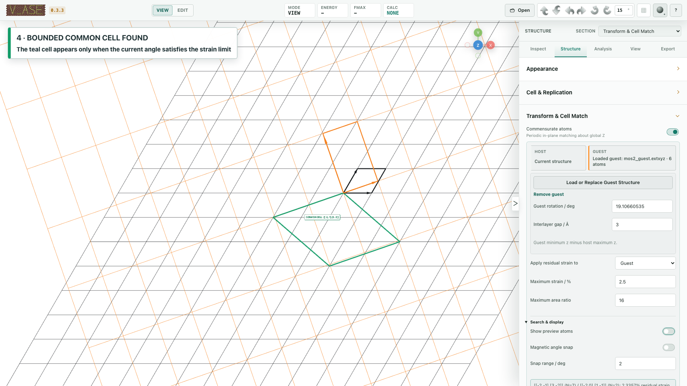
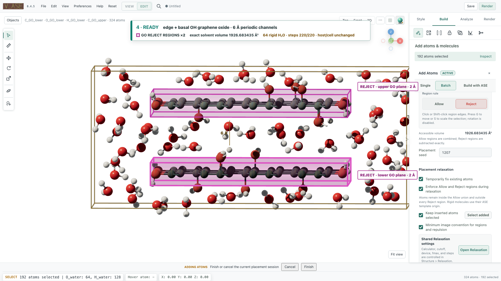

# Numerical audit of the current source

These are **0.3.4 source changes after 0.3.3**. The audit checks the
implemented geometry and numerical methods; it does not validate an interatomic
potential or establish equilibrium for a generated material.

**Verified on 8 September 2026:** 839 tests passed, none skipped. This includes
real browser, MCP (memory/legacy/stdio/HTTP), CLI, notebook and export checks.
44 capture files were regenerated; the unchanged macOS Quick Look recording
was retained. All 45 files were synchronized, preserving the original README
media references. Documentation passed a warning-free
HTML build, link checking and 14 desktop/mobile page checks.

```{contents} Feature checks
:local:
:depth: 1
```

| Feature | Correction | Independent check |
| --- | --- | --- |
| Periodic distances | Reduced lattice; periodic rows only | Bounded integer-image enumeration |
| Random/homogeneous placement | Preserve volume sampling and explicit spacing limits | Seeded moments, occupancy and coverage |
| Repulsion/confinement | Correct skew-face normals, joint exclusions and rigid torque | Energy finite differences and constrained minimization |
| Commensurate cells | Preserve handedness and normal heights; recover smaller cells | Analytic coincidence indices, SVD and integer quotients |
| Volumetric fields | Periodic seam, FP64 isovalues and finite mesh edges | Analytic fields and boundary coordinates |
| RDF | Skip unused partial-pair enumeration | Explicit periodic histograms and unchanged total curves |
| Trajectories/I/O | Exact integer IDs; scientific FP64 reads; skew-cell interpolation | Reordered large IDs and exhaustive image search |

## Commensurate cells



**Same angle and strain, half the area.** The graphene/MoS₂ example now finds a
7/2 host/guest area ratio at `|19.10660535|°`, with `2.3356639185%` maximum
principal guest strain. Its 6.50855 Å edges meet at 60°. The 0.3.3 result used
a doubled rectangular 14/4 cell. These area ratios refer to each input cell;
the MoS₂ input is rectangular.

| Case | What is now checked |
| --- | --- |
| Left-handed input | No reflection of the atomic basis or artificial residual strain |
| Oblique vacuum vector | In-plane deformation preserves every atom's normal coordinate |
| Square coincidence lattice | 90° has index 1; 36.86989765° has index 5 |
| Skew representation of graphene | Basis reduction recovers the analytic 1.05012088° / index-2977 member |
| Integer supercell | Exactly `abs(det M)` unique translations in a half-open cell, including negative determinants and large shears |

The host/guest search checks 20 determinant-one reduced-basis correspondences.
It remains bounded by area limits, descriptor screening and 0.01° result buckets.
The hexagonal same-lattice path uses the documented analytic subfamily. These
tests establish the listed cases, **not completeness over all integer bases**.
The algorithm is an adaptation of the published methods; acceptance uses maximum
principal stretch, while the paper-style mean strain is a separate descriptor.
See [equations and references](commensurate_validation.md).

## Atomic distributions and repulsion



Random sampling remains uniform over the accessible volume. Homogeneous placement
adds spatial correlation through a bounded greedy spacing procedure; it is not
optimal packing or thermodynamic sampling.

The confinement penalty is `E = k d² / 2`, where `d` is the shortest Cartesian
distance to the feasible domain closure. The new projection handles skew cell
faces and overlapping exclusions together. Away from tied nearest faces, forces
agree with the negative energy gradient. A rigid molecule's native-origin offset
contributes torque as well as translation. Exact overlaps and tied boundaries
still require a deterministic choice where no unique derivative exists.

Hard projection now precedes reporting the final positions, energy and force.
Both ordinary and insertion relaxation report `steps` if the force criterion was
not met. Conflicting atomwise constraints on rigid inserted molecules fail before
changing the working structure.

Complex region requests are bounded before expensive allocation: 4,096 candidate
periodic images per region, 250,000 partition cells, and 2,000,000 component images
per projection. Reduce domain complexity when a limit is reached; the application
does not replace the requested geometry with an approximate region.

## Volumetric fields


| Operation | Numerical convention |
| --- | --- |
| Periodic, endpoint-exclusive section | Linearly interpolate the final voxel back to the first |
| Finite section | Clamp to the last sampled coordinate; do not invent an extra endpoint |
| Field combination | Require origin agreement within an absolute `1e-6 Å`, independent of common translation |
| FP64 isosurface | Subtract the requested level before the marching-cubes FP32 conversion |
| Coarse mesh | Retain the domain endpoint even when stride does not divide the grid extent |
| Mesh smoothing | Fix finite outer boundary vertices, including endpoint-exclusive grids |

Tests use analytic periodic/affine fields, mixed boundary conditions, large common
origins, and small variations above a large FP64 offset. Mesh coarsening and
smoothing remain display approximations: coarsening can miss unsampled features,
and neither operation changes source-grid integrals.

## RDF, trajectories and file identity


Total-only RDF now avoids counting unused labels and constructing quadratic
label-pair combinations. Explicit periodic-image histograms still verify the
same curve and normalization. This does not add a slab-specific RDF correction.

Fast LAMMPS display remains FP32. Scientific ASE frames and exports reread numeric
data in FP64, and atom/molecule IDs remain int64 throughout mapping. Regression
files include adjacent IDs above `2²⁴` and `2⁵³`, reordered frames, changed IDs,
duplicate IDs, and values near the int64 upper limit. Invalid identities fail
instead of joining different atoms. Global calculator stress/dipole tensors no
longer appear as per-atom colors just because their shape happens to match the
atom count.

Restricted triclinic dump bounds now recover the tilted cell instead of its
axis-aligned bounding box; general `abc origin` boxes are decoded directly.
Cartesian and scaled coordinates agree in the original Cartesian frame, including
nonzero origins. Cell origins survive JSON/native state, frame changes, cell
guides, CAD edges and `.vase` reopening. The project manifest preserves origins
that ASE `.traj` alone would drop. An origin change disables a positions-only cache, as does
any change in the cell matrix. A general-triclinic header without boundary flags
is treated as finite: the file does not establish periodicity.

The fast path rejects changing atom types and advises reopening in Edit mode,
where the safe reader preserves each frame's species. A failed frame read leaves
the previous frame intact. The supported coordinate and boundary conventions
are summarized in [file formats](formats.md#lammps-dump-geometry).

Movie interpolation selects a nearest periodic image using the midpoint cell
metric, then interpolates endpoint fractional positions and cells. The chosen
image is fixed for each frame interval; this is a display path, not molecular
dynamics. A bounded QR sphere search replaces fractional-component rounding.
Singular endpoint cells retain the documented Cartesian fallback
(`micApplied=false`); difficult searches fail explicitly at 10,000 candidates per
atom or 2,000,000 per frame. Python displacement analysis and offline HTML also
support independent periodic rows when the full 3D cell is singular.

## Performance measurements

The [timing record](benchmark-results/scientific-source-audit.json) contains all
samples, versions and workload sizes. It compares the current source with the
local `v0.3.3` tag in one environment, without a checkout. These are kernel and
warm-file measurements, not whole-application speedups. An expanded lattice
search and more accurate interpolation do different work from the baseline.

Median milliseconds, seven repetitions on the recorded development machine:

| Workload | 0.3.3 / ms | Source / ms |
| --- | ---: | ---: |
| MIC, 1,024 × 24 vectors | 128.82 | 24.10 |
| Total RDF, 2,000 atoms / distinct labels | 93.65 | 1.43 |
| Lattice search, area ceiling 64 | 566.59 | 470.41 |
| Display read, 10,000 atoms | 4.44 | 4.50 |
| Scientific read, 10,000 atoms | 4.52 | 4.65 |
| Orthogonal interpolation, 10,000 atoms | 1.89 | 2.75 |
| Skew interpolation, 10,000 atoms | 1.82 | 4.95 |

Cached MIC is 5.34× faster for this case; total RDF is 65.44× faster with an
identical curve. The lattice search is 1.20× faster while expanding 8 to 20
correspondences. Display reads are essentially unchanged; FP64 scientific reads
cost about 3% more. Orthogonal interpolation keeps the same coordinates with
additional validation and projection work.

The RDF gain depends on many unused labels; it is not a promise for ordinary
two-element RDFs. In the skew interpolation workload, 2,826 atom paths differ
from component rounding. The independent trajectory tests establish the nearest-
image convention. The additional roughly 3 ms is an accuracy cost, not a speedup;
rendering and encoding are outside this kernel measurement.

```bash
python scripts/benchmark_scientific_audit.py --baseline v0.3.3 --repeats 7 --output docs/benchmark-results/scientific-source-audit.json
```

## Reproduce

Run the independent numerical regressions, then the complete suite:

```bash
python -m pytest -q tests/test_commensurate_audit_2026.py tests/test_insertion_scientific_geometry.py tests/test_analysis_field_audit.py tests/test_io_scientific_audit.py tests/test_trajectory_interpolation.py tests/test_registry_analysis.py
python -m pytest -q
python scripts/generate_ai_tool_reference.py --check
python scripts/capture_readme_screenshots.py
```

Browser, MCP, CLI, notebook and offline-export checks belong to the complete
suite. A skipped browser test is not a successful visual check. See the
[release checklist](release_checklist.md) for build and publication requirements.

Boundary conventions follow the [ASE geometry documentation](https://docs.ase-lib.org/ase/geometry.html),
[LAMMPS dump format](https://docs.lammps.org/dump.html), and
[SciPy interpolation modes](https://docs.scipy.org/doc/scipy/reference/generated/scipy.ndimage.map_coordinates.html).
