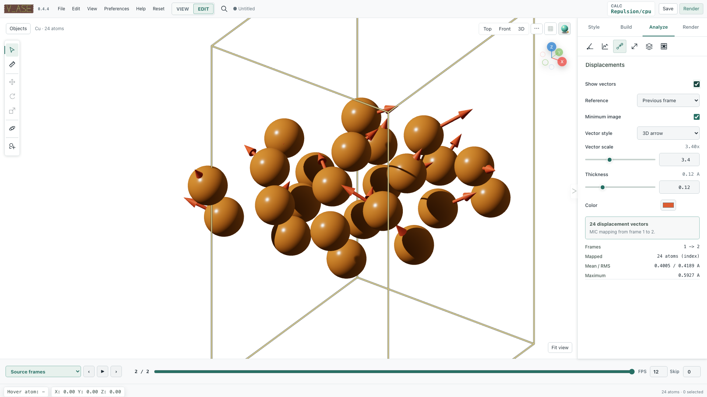

# Displacement and force vectors

Show how atoms moved relative to a reference frame, or draw forces already
stored in the input. Open **Analysis** and choose displacement or force controls.
Reading stored forces does not run a calculator.

## Displacement analysis

Open **Analysis > Displacement** and enable **Show vectors**.

1. Choose **Previous frame** or **Specific frame** as reference.
2. For a specific reference, enter its displayed one-based frame number in the
   GUI.
3. Keep **Minimum image** enabled for periodic particle motion unless an
   unwrapped Cartesian path is intentionally required.
4. Choose **3D arrow** or **2D flat arrow**.
5. Adjust vector scale, thickness, and color.

The backend prefers a common unique particle-ID array. Equal-size frames can
fall back to atom index. Different-size frames without a valid mapping return
an error rather than pairing unrelated atoms.

Displacement vectors retain physical values. The renderer anchors them at
current visible positions, repeats them with displayed supercells, and applies
the same visual translation to both endpoints. Scaling changes arrow length,
not the stored displacement.



## Stored force vectors

Stored SinglePointCalculator forces are retained when frames are copied for
analysis. Semantic structure/full descriptions read the displayed frame's
exact stored properties even when force arrows are hidden; compact descriptions
return property counts, and `includeProperties:true` requests the arrays.

Open **Analysis > Forces** and enable **Show vectors**. Choose 3D/2D style,
length scale, thickness, and color.

Force arrows use only values already stored on the active frame in an ASE
array or calculator result. v_ase does not run an attached calculator merely
to draw an arrow. If forces are missing or nonfinite, the feature remains
unavailable rather than reusing another frame's buffer.

For stored Cartesian vector `F`, the displayed direction is exactly the
direction of `F` and the arrow length is:

```text
forceVectorScale × |F|
```

Displayed supercells repeat arrows with their atoms. During playback, force
vectors and scalar colors are reloaded from the same active frame.

## Inspect one atom's stored properties

One selected atom exposes properties lazily for the active frame. The detail
can include:

- index, symbol, label, position, mass, tag, charge, and magnetic moment;
- arbitrary scalar, string, vector, or tensor entries from `Atoms.arrays`;
- stored calculator results; and
- stored Cartesian forces.

The property request never evaluates a calculator. A selected replica uses the
base atom's property payload while retaining its displayed replica position
for measurement.


## Example: follow a probe above a Cu surface

Download {download}`stored-forces.traj <assets/examples/stored-forces.traj>`. Open it with **File > Open**, or run this in the folder containing the download:

```bash
v_ase gui stored-forces.traj
```

1. Choose **Stored forces** and show Cartesian force arrows.
2. To match the GIF, use 3D arrows, scale **3.4**, thickness **0.04**, and
   color `#db4b32`. The global atom-radius multiplier is **0.46**, bonds are hidden.
3. Play the 14 frames. The O probe moves; Cu atoms stay at fixed coordinates
   while their supplied force vectors change.
4. Switch to displacement relative to frame 0. Stationary Cu should have zero
   displacement even though it has nonzero stored forces.
5. Use a [scalar colorscale](scalar-colors.md) to compare force magnitude by color.

```{vase-animation} assets/readme_atom_colorscale.gif
:alt: Analytic stored probe-response forces on Cu, not a DFT or MD trajectory.
:fallback: assets/readme_atom_colorscale.png

Analytic stored probe-response forces on Cu, not a DFT or MD trajectory.
```
