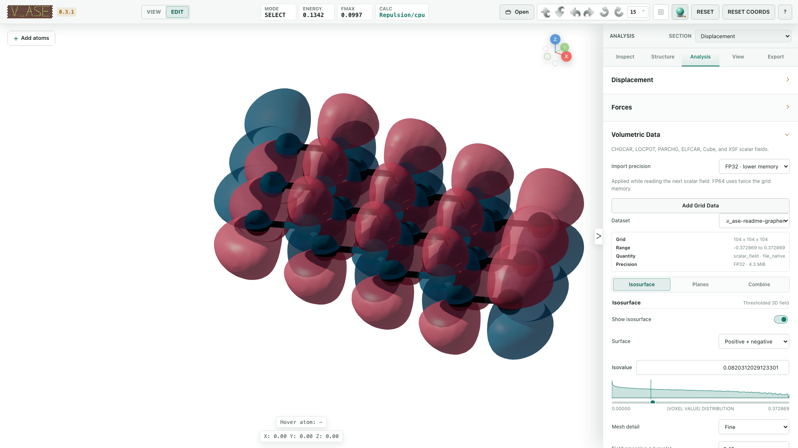
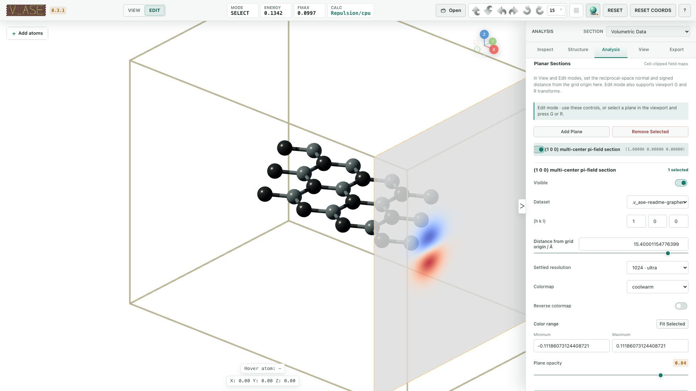

# Volumetric fields

v_ase keeps scalar grids in the Python backend and sends only compact metadata,
isosurface meshes, and sampled planar rasters to the browser. This allows large
DFT fields to remain aligned with their ASE structure without serializing the
complete 3D array into the page or an AI-agent context.

```{contents} On this page
:local:
:depth: 1
```

## Supported inputs

Open these directly or add them to an existing document:

- VASP `CHG`/`CHGCAR` charge density;
- VASP `PARCHG` partial density;
- VASP `LOCPOT` potential;
- VASP `ELFCAR` electron-localization field;
- Gaussian Cube; and
- XSF `DATAGRID_3D`, including Quantum ESPRESSO `pp.x` exports.

VASP stems accept `.`, `_`, or `-` calculation suffixes, including
`PARCHG_band_12`, `LOCPOT.vacuum`, and `CHGCAR-difference`. Use an explicit
reader for an ambiguous filename:

```bash
v_ase gui GRID --format CHGCAR
v_ase gui charge.dat --format qe-cube
v_ase gui potential.dat --format qe-xsf
```

Opening a volumetric file creates the associated atomic structure and one or
more scalar dataset descriptors. In an existing document, use **Analysis >
Volumetric Data > Add Grid Data**.

## Choose precision before import

**Import precision** and the CLI option select storage precision while reading:

```bash
v_ase gui CHGCAR --volumetric-precision fp32
v_ase gui CHGCAR --volumetric-precision fp64
```

Python exposes the same choice:

```python
from v_ase.visualize import view

view("CHGCAR", volumetric_precision="fp64")
```

- FP32 is the lower-memory default.
- FP64 preserves double-precision input and uses twice the grid memory.

Changing a display control later does not convert the stored dataset. Verify
the descriptor's precision and backend memory size after loading.

## Dataset state

Each dataset has a stable ID and reports scientific metadata including:

- source name and canonical format;
- quantity, component, units, and precision;
- grid dimensions, cell, origin, and PBC;
- endpoint convention and memory bytes;
- minimum, maximum, mean, and integral; and
- fixed 256-bin raw and absolute-value histograms.

Histogram counts sum to the source voxel count and remain unchanged when
isosurface, plane, camera, color, or opacity settings change. Select datasets
by ID rather than list position when automating a multi-grid document.

### Interpret the integral

VASP charge grids are divided by cell volume on import; their integral equals
the average raw grid value (the electron count for an ordinary total-charge
grid). LOCPOT values retain eV and are not divided by volume. Cube and XSF
retain their reported/native scalar units; do not infer an electron count from
an unlabeled field.

Endpoint-exclusive grids use equal voxel weights. For endpoint-inclusive grids,
periodic closing planes are excluded once, while finite axes use trapezoidal
half weights at both endpoints. The determinant of the complete triclinic cell
supplies the volume Jacobian. `mean` is the arithmetic mean of stored samples;
it need not equal the integration-weighted mean on an endpoint-inclusive grid.

:::{admonition} Source grids are immutable analysis inputs
:class: important
Isovalue changes, Gaussian smearing, mesh smoothing, color, opacity, and
planar sampling operate on display products. They do not replace the stored
FP32/FP64 scalar field, its integral, or the arrays used in a linear
combination.
:::

## Create an isosurface

Open **Analysis > Volumetric Data > Isosurface**:

1. Select a **Dataset**.
2. Enable **Show isosurface**.
3. Choose **Single level** or **Positive + negative**.
4. Set a finite **Isovalue**.
5. Choose mesh detail, colors, opacity, smearing, and smoothing.
6. Select **Update Isosurface**.
7. Inspect the rendered topology from more than one camera direction.

A newly loaded nonconstant dataset is selected and displayed at an in-range
default level. Replace that preview value with the scientifically requested
threshold before publishing a result.



### Single and signed levels

**Single level** requests one finite scalar level. **Positive + negative** uses
the magnitude of a nonzero level and extracts `+abs(level)` and `-abs(level)`
with independent colors.

After field smearing, one requested sign may lie outside the displayed range.
v_ase retains the valid sign, marks the result as a partial signed surface, and
does not invent the missing mesh. Verify rendered levels and surface count.

### Mesh detail

The semantic mesh step is `1`, `2`, or `4`:

- `1` / **Fine** preserves the most grid detail;
- `2` / **Balanced** reduces work; and
- `4` / **Fast** is the coarsest preview.

Use the smallest step needed to preserve the features of interest. Repeating
the same dataset, level, sign mode, detail, smearing, and smoothing request
reuses a bounded mesh cache. Changing only color or opacity restyles the
existing browser mesh without rerunning marching cubes.

### Field smearing

**Field smearing σ (voxels)** accepts `0` through `8`. It applies a Gaussian
filter to a display copy before surface extraction. Periodic axes wrap and
nonperiodic axes reflect at their boundaries.

Sigma is measured in grid steps, so equal sigma on differently spaced or skew
axes is not an isotropic Gaussian in physical Å. Use it as a display filter.

Smearing can merge small features or move an isovalue outside the displayed
range. Start around `0.3`–`0.5` only when grid artifacts require it, compare
against `0`, and do not describe a heavily smeared topology as raw data.

### Mesh smoothing

**Mesh smoothing passes** accepts integer `0` through `30`. It fairs the
extracted mesh after marching cubes while fixing cell-boundary vertices. It
does not smooth the source field. Use `0` to disable it.

### Colors and opacity

Positive/negative colors are six-digit hexadecimal colors. Isosurface opacity
is `0.05`–`1`. These are presentation settings and do not affect scalar
values. Isosurfaces follow display replication and visual translation with the
atoms.

## Inspect the result scientifically

The active surface summary reports:

- dataset ID and source range;
- requested and rendered levels;
- post-smearing display minimum and maximum;
- smearing sigma and smoothing passes;
- surface and triangle counts; and
- whether a signed surface is partial.

An HTTP success is not enough. Render the result, check that it is nonblank,
inspect cell seams and topology, then compare the source dataset descriptor to
confirm the display refinement did not replace it.

## Add planar sections

Open **Analysis > Volumetric Data > Planes** and choose **Add Plane**. Each
plane contains:

- stable ID and editable name;
- dataset ID and visibility;
- a nonzero reciprocal-space `(h k l)` normal;
- signed distance from the stored grid origin in angstrom;
- settled resolution of 128, 256, 512, or 1024;
- a registered Matplotlib colormap and reverse state;
- automatic or manual `vmin`/`vmax`; and
- opacity.

`(h k l)` defines a Cartesian normal using the reciprocal cell. `[0,0,0]` is
invalid. The distance is measured from the dataset's stored grid origin along
that unit normal, not from an atom, selection, or inferred cell center. If no
offset is supplied, v_ase centers the plane in the displayed cell/supercell.

The backend clips the section to the exact orthogonal or triclinic displayed
cell and samples it with periodic trilinear interpolation. Only the compact 2D
raster and clipping polygon reach the browser; displayed supercells do not
materialize a repeated 3D grid.



### Edit one or several planes

Select plane rows with click or Shift-click. Shared values remain visible;
mixed values are blank until a common replacement is entered. One edit is
applied atomically to every selected ID. An unknown ID, zero normal,
unsupported resolution/colormap, opacity outside its range, or manual
`vmin >= vmax` rejects the complete edit.

Use **Fit Selected** to resolve the range from the selected plane data. Use a
fixed manual range when several planes must remain directly comparable.

### View and Edit mode behavior

Planes can be created and configured in View. This changes only analysis and
display state, never ASE atom coordinates.

In Edit, a selected plane can also be manipulated in the viewport:

- `G` moves each selected plane along its own normal; and
- `R`, optionally locked with `X`, `Y`, or `Z`, changes the normal and `(hkl)`.

The distance, slider, `(hkl)` fields, and list label follow the live transform.
Interactive motion uses a lower-resolution preview, then restores the
configured settled resolution. A newly typed `(hkl)` becomes authoritative
immediately even if an older high-resolution request is still pending.

## Combine compatible datasets

Combination accumulates bounded slabs in FP64 and rounds once to the requested
output precision. FP32 remains the memory-saving default when all inputs are
FP32; import FP64 before subtraction when small differences matter. Converting
an already rounded FP32 source later cannot recover lost input digits.

Open **Analysis > Volumetric Data > Combine** and enter finite coefficients.
A common charge-density-difference form is:

```text
Δρ = ρ_combined - ρ_fragment_A - ρ_fragment_B
```

The source datasets must match exactly in:

- grid dimensions;
- cell and origin;
- PBC and endpoint convention; and
- physical units.

v_ase refuses mismatched grids instead of silently interpolating or
resampling. When output precision is omitted, a combination promotes to FP64
if any input is FP64; otherwise it remains FP32. The new dataset receives its
own stable ID, descriptor, and histogram.

## Cell, replication, and reset behavior

Visual `display.supercell` repeats the isosurface and planes with the atoms
without changing stored data. Visual translation moves atoms, bonds,
constraints, surfaces, and planes together.

**Set Supercell as Cell** physically repeats atoms and every stored volumetric
grid for a diagonal integer repetition, with one atomic Undo entry. A general
non-diagonal cell matrix is rejected while grids are loaded because an
explicit scientific interpolation policy would be required.

After a materialized diagonal supercell, **RESET COORDS** restores the original
atoms, cell, and scalar grids together. Undo/Redo preserves the atom/grid
pairing.

## Save and export volumetric work

Reopening a project restores and samples all visible saved planes before the
document reports ready, so its first render includes the same planar rasters.

A `.vase` project retains stored datasets, precision, current frame, visual
settings, and supported analysis state without pickle. A project-embedded HTML
save contains the complete validated `.vase` plus a browser-ready view.
Lightweight HTML contains the rendered/view-only scene but is not a lossless
editable scalar-grid interchange.

Images and HTML use the persistent Render Area. Before export, verify surface
or plane visibility, opacity, crop, camera, axes, cell, background, and exact
render dimensions. Use `.vase` as the editable source of truth.

## Semantic workflow

These are separate JSON request bodies for `v_ase api ... apply --params-file`.
They are not a single script. Fetch the current revision and dataset/plane IDs
with `describe`; the numbers and IDs below illustrate the fields to replace.

### Load a field

Load a grid from a path confined to the directory in which `v_ase gui` was
launched:

```json
{
  "expectedRevision": 12,
  "operation": {
    "name": "load-volumetric",
    "path": "charge/CHGCAR",
    "precision": "fp64"
  }
}
```

### Display a signed surface

Call `describe`, take the returned stable dataset ID, then create an exact
surface:

```json
{
  "expectedRevision": 13,
  "operation": {
    "name": "show-volumetric",
    "datasetId": "DATASET_ID",
    "level": 0.015,
    "surfaceMode": "signed",
    "stepSize": 1,
    "smearingSigma": 0.4,
    "smoothingIterations": 6,
    "opacity": 0.72,
    "positiveColor": "#2a9d8f",
    "negativeColor": "#d1495b"
  }
}
```

### Add a crystallographic plane

Add a plane:

```json
{
  "expectedRevision": 14,
  "operation": {
    "name": "add-volumetric-plane",
    "datasetId": "DATASET_ID",
    "planeName": "(1 1 0) section",
    "hkl": [1, 1, 0],
    "offsetAngstrom": 2.5,
    "resolution": 512,
    "colormap": "viridis",
    "reverse": false,
    "autoRange": true,
    "opacity": 0.9,
    "visible": true
  }
}
```

### Change plane colors and range

Edit or remove planes only with IDs returned by
`describe().analysis.volumetricPlanes`:

```json
{
  "expectedRevision": 15,
  "operation": {
    "name": "update-volumetric-planes",
    "planeIds": ["PLANE_A", "PLANE_B"],
    "colormap": "coolwarm",
    "autoRange": false,
    "vmin": -0.08,
    "vmax": 0.08,
    "opacity": 0.82
  }
}
```

### Subtract fragment fields

Combine fields. `name` selects the command and `resultName` labels the output:

```json
{
  "expectedRevision": 16,
  "operation": {
    "name": "combine-volumetric",
    "datasetIds": ["COMBINED", "FRAGMENT_A", "FRAGMENT_B"],
    "coefficients": [1, -1, -1],
    "resultName": "charge-density difference",
    "precision": "fp64"
  }
}
```

Related operations are `load-volumetric`, `show-volumetric`,
`add-volumetric-plane`, `update-volumetric-planes`,
`remove-volumetric-planes`, `combine-volumetric`, and `remove-volumetric`.
Use the current collaboration revision on every mutation.
The numeric revisions in these examples are illustrative; `describe` is the
source of the next exact value.

## Limits and failure behavior

- A scalar array must be three-dimensional with at least two samples per axis.
- The default source-grid ceiling is 134,217,728 points. Override
  `V_ASE_MAX_VOLUMETRIC_POINTS` only after confirming available memory.
- The default surface safety ceiling is 2,000,000 triangles per surface.
- Smearing is limited to 0–8 voxels; smoothing to 0–30 passes.
- Semantic surface step is 1, 2, or 4; plane resolution is 128, 256, 512, or
  1024.
- Dataset removal requires an exact stable ID.
- Relative semantic paths cannot escape the GUI launch directory.
- Constant fields remain stored but cannot produce an isosurface crossing.
- A mismatched linear combination or invalid plane edit is rejected without
  partially mutating the document.

## Verification checklist

Before presenting a volumetric result, record and verify:

- source filename/type, quantity, component, units, precision, and memory;
- grid dimensions, cell, origin, PBC, and endpoint convention;
- raw minimum/maximum/integral and histogram mode;
- dataset ID, isovalue, sign mode, detail, smearing, smoothing, opacity, and
  rendered mesh counts;
- for every plane: ID, nonzero `(hkl)`, signed offset, resolution, map, range,
  opacity, visibility, and displayed-cell repetition;
- exact compatibility and coefficients for a linear combination;
- atom/grid alignment after translation, replication, frame change, Undo, or
  reset; and
- a decoded, nonblank render inspected from the intended camera.
