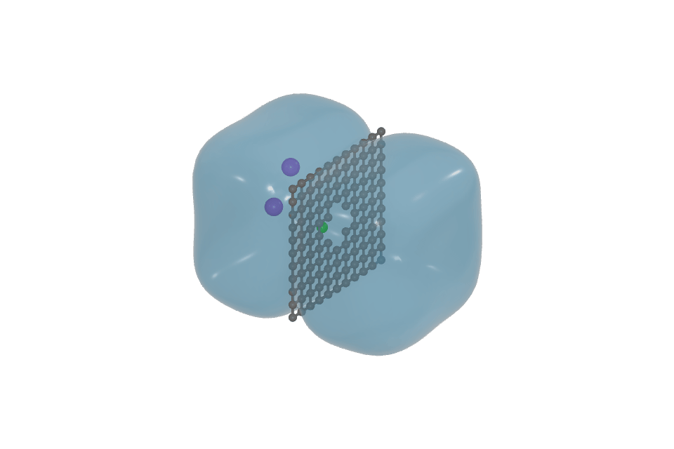

# Water surface — experimental branch

Open **Style → Water**, enable **Show water surface**, then adjust color,
opacity and **Lighting & reflections**. **Replace molecular spheres** hides only
the water molecules participating in the visible envelope; disable it to inspect
both representations. Ions, membrane atoms and other species stay atomistic.
**Objects → Water surface** controls the same layer.

This experiment belongs to `codex/water-surface`; it is not in the published
0.4.7 app. The original checkout and `main` remain separate.

## What the surface means

Water uses the source's positive integer molecule IDs (`mol`, `molecule_id`,
`molecule_ids`, `molid` or `mol-id`) when present. A declared group must contain exactly one
O and two H, with both O–H distances inside the chemical cutoff (default 1.25 Å),
including periodic images. It never borrows H from a neighbouring declared
molecule. Groups that are not H₂O stay atomistic. IDs are independent of mutable
visual labels; zero/unassigned IDs fall back to geometric neighbour detection.

Without IDs, each H belongs to its nearest O inside the cutoff; an O with exactly
two assigned H qualifies. This fallback is a geometric heuristic. Hydronium,
hydroxide, coarse-grained water and heavily dissociated structures are not H₂O.

The displayed surface is an isosurface of a sum of Gaussian oxygen-centred
kernels. **Smoothing** is the kernel width in Å; **Density threshold** is a
relative scalar threshold, not a calibrated density in g/cm³. Lower thresholds
expand the envelope. Large smoothing can connect nearby regions across a narrow
membrane or gap: inspect the molecular representation and adjust it. The envelope
does not infer a physical liquid boundary, fill the simulation box automatically,
or solve fluid dynamics. No artificial time-dependent waves are added.

**Selected water oxygens → Use current selection** captures base oxygen indices.
Later selection changes do not redirect the layer. Missing indices are retained
across trajectory frames. Only currently detected H₂O in the scope is drawn.
The same-index correspondence is visual, not a claim of chemical identity during
reactive simulations.

## Playback and output

The surface is regenerated from the coordinates actually drawn, including
interpolated trajectory/movie samples. A coalesced build at the draw boundary
keeps the atoms and their water envelope in one render. Stored molecule IDs are
committed with each frame; sources with changing IDs bypass coordinate-only
caches, including while the layer is off. Video interpolation rejects changed IDs
and asks for original source-frame export instead. Changing only camera pose
reuses geometry. Color/opacity/lighting changes do not rebuild the density grid.

Image and movie/GIF captures use the same surface and Render Area as the viewer.
`.vase` stores water settings; self-contained HTML embeds the local geometry and
renderer modules and works offline. There are no new Python dependencies.
In flat display mode the surface is unlit; saved lighting preferences remain.

The current envelope is available in canvas/PNG/video/GIF/HTML. **Blender, OBJ and
Rhino geometry exports do not yet include this experimental layer.** Those formats
are explicitly rejected while the layer is enabled, so they cannot silently
omit the water. Disable the surface deliberately to export molecular geometry.

## Performance and bounds

The implementation reconstructs a Gaussian density on the CPU, then creates an
**indexed boundary mesh**: interior grid cells create no geometry, and adjacent
surface faces share vertices. Source molecules inside the liquid contribute to
the density, but their individual sphere and bond instances are removed from the
GPU draw count when **Replace molecular spheres** is on. Bounded scratch arrays
are reused across builds to reduce allocation and garbage collection; each mesh
owns its output buffers, so another frame/document cannot overwrite it. Scientific atom data,
selection identities and coordinates remain available and return when it is off.
This also applies to repeated cells and individually hidden instances.

Orbit, pan, zoom and color/opacity/light changes reuse the completed mesh. New
coordinates, molecular topology, source scope, source visibility, shape settings
or displayed repetitions invalidate it. Trajectory samples must recalculate the
surface; a static view does not. It does not promise a universal frame rate.

The lattice is world-anchored. Grid spacing adapts to bounded allocation/work:
1,200,000 samples, 512 per axis, 120,000,000 estimated kernel samples and up to
500,000 displayed molecules. These are safety limits, not recommended workloads.
Effective spacing and build time are shown explicitly; an unresolved or excessive
request fails visibly and restores molecular spheres. There is no old 200,000
triangle cutoff: index/vertex allocation is bounded by the grid itself.

Repetitions use exactly the renderer's signed cell offsets (for example three
copies are −1, 0, +1). The surface is reconstructed over the combined visible
molecules, including cross-cell neighbours, so internal cell seams are not capped
by duplicating a finished single-cell shell. A hidden base atom does not discard
its visible replicas. The envelope extends around displayed molecules rather
than clipping to the simulation cell faces. Source detection with IDs bounds
periodic images using reciprocal vectors, including the geometric fallback for
unreduced cells. Geometric detection bounds the image search to 4,096 shifts and
2,000,000 oxygen image entries; excessive requests fail with a cell-basis or
molecule-ID remedy rather than silently missing neighbours.

## Renderer quality and recovery

Open **Render → Renderer → Quality** (Cmd+Shift+A on macOS; Ctrl+Shift+A on
Windows). **Atom & bond segments** accepts even integers from 8 to 128. It
controls live spheres and cylindrical bonds together, including repeated atoms
and normal image/movie/GIF output. This changes geometric detail, never bond
lengths, physical atom radii, positions or constraints. Anti-aliasing smooths
pixel edges; it cannot repair a low-resolution sphere silhouette.

Previously, the Renderer “Ultra” option changed export quality only while the
viewport could remain at Automatic (12 segments in a large scene). Bonds stayed
at 16 segments. The numeric control removes that mismatch. Legacy projects and
preset-based agent commands remain supported (`atomSmoothness:0`); changing a
legacy viewport preset explicitly returns to that mode. Image/video dialogs can
still override output quality deliberately, but default to the Renderer setting.

At a given zoom, the renderer uses the smallest cached sphere/cylinder geometry
that meets a 0.2 drawing-buffer-pixel silhouette error, up to the requested
segment ceiling. It does not reduce close-up quality merely because there are
many atoms. Instances outside the camera are omitted from that draw; scientific
instance IDs, selection, per-atom radii, water packing and trajectory buffers are
restored afterward. Off-screen shadow casters are retained in shadow mode.
Output applies the same rule at its actual resolution. A conservative interactive
20-million atom/bond-triangle guard rejects extreme GPU workloads before
submission, switches to 12 segments with an explicit message, or retains the last
completed view if even that exceeds the budget. Hide objects or reduce repetitions
to recover. Exact exports are not silently limited by this interactive budget.

**Surface interpolation** independently controls isosurfaces and water:

| Level | Result |
| --- | --- |
| 0 | Original indexed mesh |
| 1 | Curved-edge subdivision, four triangles per source triangle |
| 2 | Two passes, sixteen triangles per source triangle |

Interpolation follows vertex normals, preserves all original mesh vertices and
keeps open boundaries straight. It is a display approximation, not additional
scalar-field information. Water density width/grid spacing and the volumetric
field smearing/mesh-fairing controls remain separate. Coordination polyhedra keep
their scientific planar faces. A request exceeding **2,000,000 resulting triangles
per surface** or 4,000,000 across refined surfaces is rejected with a remedy; it never allocates an unbounded mesh.

Refinement yields to input roughly every 6 ms of CPU work. A non-modal progress
strip remains visible even if the panel is scrolled away; **Cancel** or **Esc**
restores the preceding quality. **Revert quality** also works after completion;
**Lightweight** uses 12 atom/bond segments and original surfaces. Changing quality
is a normal reversible visual-history edit. Recovery cannot interrupt an already
submitted GPU driver call; projected-size detail, culling and the preflight budget
prevent the largest avoidable submissions.

Camera and material changes reuse the refined geometry. A changing water frame
retains the last completed refined surface while its replacement is prepared;
newer frame requests cancel stale work. Live playback can lag the newest source
frame if refinement takes longer than the frame interval. Image and movie/GIF
capture explicitly await the current frame's final geometry. Lower interpolation
for faster live playback. Offline HTML carries the same renderer and refinement
code with no network dependency.

The approach follows Blender's separation of interactive simplification from
render detail and its cancellable work, while keeping v_ase's scientific geometry
and explicit quality controls. See [Blender Simplify](https://docs.blender.org/manual/en/4.5/render/cycles/render_settings/simplify.html)
and its [progress and cancellation status bar](https://docs.blender.org/manual/en/latest/interface/window_system/status_bar.html).

## Reproducible example

```sh
python examples/water_surface.py
```

This creates 24 synthetic frames containing 150 water molecules, a perforated
carbon-like sheet and ions. It is an illustration of rendering behavior, **not an
MD trajectory, membrane permeability calculation or desalination result**. It
requires no proprietary reference image or video assets.



The GIF above was exported by the application: 24 frames, 960 × 640 pixels,
15 px/Å, infinite loop, 64 atom/bond segments and water interpolation level 1. It uses the same rendered water layer as live playback.
The light effects use surface shading and environment reflections; this prototype
does not implement physically accurate refraction through the fluid.

## Validation and next integration gate

Verification on 2026-09-28: **1,119 full-suite tests passed**, followed by a final
**16-test quality/polyhedra run** covering the added schema, curved mesh,
project persistence, cancellation, stale surface errors and draw-buffer checks.
The strict Sphinx HTML build, wheel/sdist build and `twine check` passed. The built
wheel was smoke-checked in a temporary environment sharing installed dependencies;
this is not a clean published-release installation test. No release was performed.

The large-system revision checks stored molecule topology, closed indexed meshes
(including dense low-threshold boundaries), real GPU instance counts, cached
camera/material changes, signed repetitions, replica picking, per-instance
visibility, streamed topology changes and recovery after a rejected surface.

On a supplied **52,272-atom snapshot containing 13,560 water molecules**, all
13,560 declared H₂O groups were recognized. The previous nearest-neighbour-only
prototype missed 48 groups. With replacement enabled, 40,680 individual water
atom instances were excluded: only 11,592 non-water atom instances remained.
The entire scene's submitted triangles fell from approximately **13.92 million
to 4.25 million** (69%). This is actual draw-count reduction, not zero-radius
spheres still submitted to the GPU. The surface itself used about 303,000
triangles and 151,000 shared vertices; observed browser builds took roughly
110–125 ms.

A **2 × 1 × 1** displayed supercell produced an envelope from all 27,120 visible
water molecules. Both base and replicated water sphere instances were omitted;
non-water atoms and replicas remained. Grid spacing adapted to the larger extent
and was reported to the user. Camera/material-only changes caused no rebuild.
Source coordinates were unchanged, with no browser page errors.

At 960 × 640, completed rendering **plus full pixel readback** took median
1.84 s with the surface and 4.37 s with molecular spheres over three samples
(first sample included warm-up). This test used **Chromium's SwiftShader software
renderer**, not the Mac's native GPU: the roughly 2.4× comparison demonstrates
reduced rendering work, not native FPS or a universal performance guarantee.
CPU draw-submission timing alone is not used as frame-rate evidence.

The numeric-quality revision was also measured on the same 52,272-atom source.
With the water surface on, an equivalent whole-scene view submitted **5,947,184
triangles with legacy geometry versus 3,402,416 with a 64-segment ceiling and
projected-size detail** (43% fewer). Water interpolation level 1 produced
1,211,488 water triangles and 5,219,648 triangles across the scene. During the
cooperative refinement, a browser heartbeat continued to run (32 ticks). At a
120 px/Å close-up, atoms reached 64 segments while 37,386 off-screen atom/bond
instances were omitted from the draw. Source coordinates were identical and no
page errors occurred. These are draw-count and responsiveness measurements,
not a native-GPU FPS promise. The timing harness includes completed software
rendering and pixel readback, so it is not used to claim pure mesh-build latency.

The supplied file contains one snapshot. Moving-water coverage therefore uses
the synthetic 24-frame example and changing-topology browser regressions, not a
claim that this user's full MD trajectory was tested. The application-exported
960 × 640 GIF was regenerated and its first/middle frames inspected. Exact-size
PNG, offline HTML, project round-trip, selection, undo/redo and error recovery are
also covered. Large real trajectories remain a prerequisite for main integration.

Run `tests/test_render_quality.py`, `tests/test_browser_render_quality.py`,
`tests/test_water_surface.py`, `tests/test_browser_water_surface.py`, existing
HTML/video export tests, project consistency and typed AI schema tests. Check real
playback, exact exported dimensions, scientific coordinate immutability,
visibility on/off, custom labels, periodic water, captured scopes, malformed data,
no-water frames, document switches and undo. Inspect the resulting image/movie.

Before a main/release integration: benchmark larger real aqueous trajectories,
complete geometry-export parity, test unusual periodic cells and reactive water
labels, decide whether worker/GPU reconstruction is needed for the supported
workloads, and execute the full release checklist with refreshed examples. Do not
publish this experiment as a validated fluid solver.
