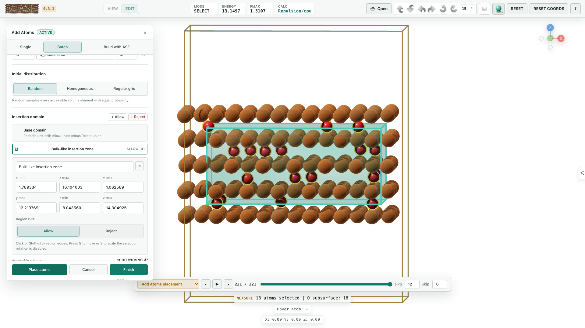
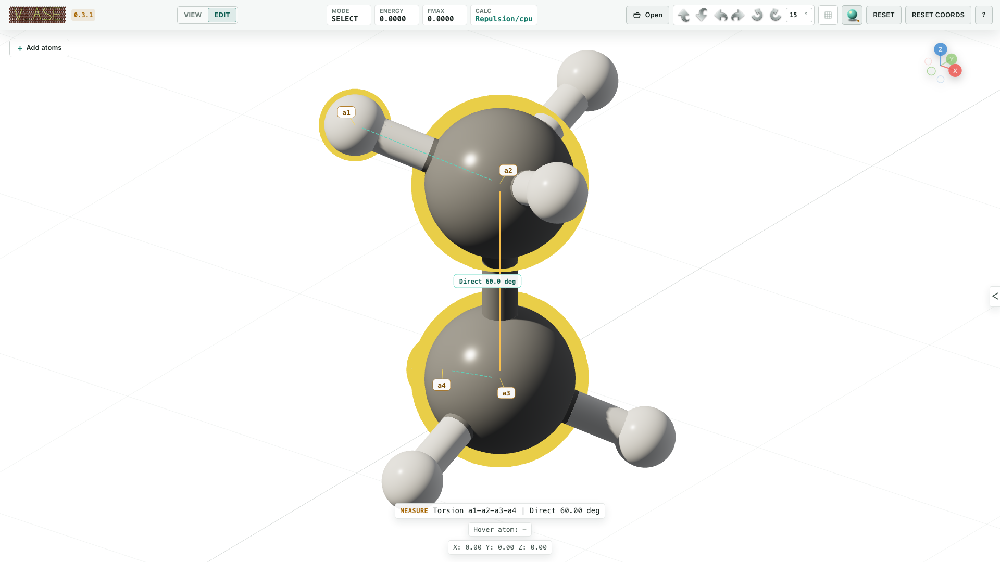

# Worked examples

These source-checkout examples turn the general controls into reproducible
atomistic workflows. They use the fixtures under
`examples/readme_scene_assets/`; each command opens real scientific data rather
than a prerecorded mock interface.

:::{note}
The fixtures demonstrate editing, visualization, and geometric analysis. The
built-in repulsion examples remove short contacts; they are not predictive
energy calculations.
:::

```{contents} On this page
:local:
:depth: 1
```

## Rotate a ligand around an active atom

Open the idealized ferrocene trajectory in Edit:

```bash
v_ase gui examples/readme_scene_assets/ferrocene.traj --interactive
```

To keep Fe fixed while rotating a cyclopentadienyl ring:

1. Select the five ring atoms and any other atoms that should move.
2. Shift-select Fe last, making it the active atom.
3. Choose **Structure > Transform > Active atom (last selected)**.
4. Press `R`, optionally lock `X`, `Y`, or `Z`, type an exact angle, and press
   `Enter`.
5. Inspect the Fe coordinate after commit; it must be unchanged.

The active atom is a pivot, not an automatically fixed ASE constraint. Add an
explicit constraint when it must also remain fixed during later relaxation.

## Build a cumulative phosphorene twist

Open the 5 × 6 armchair black-phosphorene sheet:

```bash
v_ase gui examples/readme_scene_assets/phosphorene_nanosheet.cif --interactive
```

The model has 10 puckered ridges with 12 atoms per ridge. Green and purple can
be used as visual labels for the upper and lower P sublayers; both remain ASE
element phosphorus.

The 13.85° nanoribbon is created as a sequence of committed edits:

1. Box-select from the **second ridge through the end**.
2. Choose the global X axis, run **Rotate Selection**, and enter the exact
   per-step angle used by the trajectory fixture.
3. Advance the box boundary so the **third ridge through the end** is selected.
4. Apply the same exact rotation to the already edited coordinates.
5. Continue one ridge at a time for nine rotations.

Because every rotation starts from the previous commit, the final ridge is
rotated by exactly 13.85 degrees. Orbit from above to below and confirm that
both puckered sublayers form one continuous twist. Compare the result with:

```bash
v_ase gui examples/readme_scene_assets/phosphorene_twist_13p85deg.traj
v_ase gui examples/readme_scene_assets/phosphorene_twisted_nanoribbon_13p85deg.cif
```

The relaxed starting coordinates and target-angle references are documented by
[Villegas et al.](https://doi.org/10.1039/C6CP05566D) and
[Jang et al.](https://doi.org/10.1039/C6NR04354B). The edit demonstrates exact
geometry construction, not a final energy-minimized structure.

## Insert oxygen into a Cu(111) slab

```bash
v_ase gui examples/readme_scene_assets/cu111_oxygen_add_atoms.traj --interactive
```

The fixture is a five-layer Cu(111) slab. A reproducible staging workflow is:

1. Open **+ Add atoms > Batch > Atoms**.
2. Add 18 atoms with TYPE `O`, LABEL `O_subsurface`, and seed `2021`.
3. Create an Allow region spanning the three bulk-like interior layers.
4. Leave host freezing enabled so all pre-existing Cu coordinates, arrays,
   labels, constraints, and calculator state remain unchanged.
5. Place, inspect contacts, open the shared Relaxation controls, and run the
   staged repulsive optimizer.
6. Add another batch and relax again without pressing **Finish** when an
   accumulated staging session is intended.
7. Finish only after verifying atom count and host invariance; Cancel must
   restore the exact baseline.

The region is intersected with the half-open primary periodic cell, and
periodic images use the full triclinic lattice. Region bounds define initial
sampling unless confinement is explicitly enabled.



## Fill two solvent chambers with rigid water

```bash
v_ase gui examples/readme_scene_assets/layered_water_channel.traj --interactive
```

This periodic graphene-oxide fixture has an exact accessible solvent volume of
1926.683 ų. Two 2 Å-thick Reject regions cover the oxide planes while leaving
distinct left and right solvent chambers.

1. Open **+ Add atoms > Batch > Molecules** and choose water from the ASE G2
   catalog.
2. Enable density mode with a target of 1.00 g/cm³.
3. Keep **Randomize molecular orientation** and **Preserve molecular geometry**
   enabled.
4. Place the nearest realizable complete composition: 64 rigid H2O molecules.
5. Inspect the reported realized density and both chambers before relaxation.

Random orientation is uniform over 3D rotations. Molecules rotate about their
native coordinate origin, and rigid placement preserves every internal bond
length while allowing whole-molecule translation and rotation.

## Style a Cu2O(111)/Cu(111) interface by pair

```bash
v_ase gui examples/readme_scene_assets/cu2o111_on_cu111_pairwise_bonds.traj
```

The fixture places a `6 x 6 Cu2O(111)` film on `7 x 7 Cu(111)`, with one
interfacial oxygen registered above a substrate Cu top site. Labels separate
`Cu_substrate`, `Cu_oxide`, and `O_oxide` without changing chemical elements.

Use label-pair bonding to enable the scientifically intended connections and
disable the rest. Each pair can have its own cutoff, thickness, cylinder/flat
style, material, opacity, and color. For example, style
`Cu_oxide-O_oxide` independently from substrate/interface bonds while keeping
`Cu_substrate-Cu_substrate` disabled when the figure should emphasize the
oxide network.

Standard, Metal, and Rubber atom materials affect rendering only. Verify that
elements, coordinates, cell, PBC, and bond topology remain unchanged after
appearance edits.

## Match separate host and guest lattices

The host/guest fixture directory contains graphene, MoS2, and Cu(111) inputs:

```bash
v_ase gui examples/commensurate_host_guest/graphene_host.extxyz --interactive
```

The reference cases include a rectangular graphene `(√7 × √21) R±19.11°`
host, a MoS2 `2 × 2` guest, and a 192-atom Cu(111) slab used to inspect lateral
neighbor shells.

1. Open **Structure > Transform & Cell Match**.
2. Load the guest without replacing the host.
3. Choose the global Z projection and explicit strain target.
4. Search within bounded area/index limits.
5. Inspect both integer matrices, atom counts, residual strain, and boundary
   shell before materialization.
6. Apply only the accepted candidate, then verify the physical cell and PBC.


The search matches periodic cell boundaries. It does not calculate adsorption
energy or electronic stability.

## Measure geometry and inspect stored data

```bash
v_ase gui examples/readme_scene_assets/ethane_measurement.cif
```

Select indices `3, 0, 1, 6` in that order. The retained `a1`–`a4` selection
shows direct distance, angle, and signed torsion. For a trajectory, move between
frames without reselecting and confirm the measurement follows current
coordinates.



Stored forces and ASE arrays can be drawn or mapped with a trajectory-consistent
colorscale. These views never evaluate a calculator as an inspection side
effect.

## Inspect constraints and relaxation

Use the focused fixtures:

```bash
v_ase gui examples/readme_scene_assets/fixedline.traj --interactive
v_ase gui examples/readme_scene_assets/fixedplane.traj --interactive
v_ase gui examples/readme_scene_assets/hookean.traj --interactive
v_ase gui examples/readme_scene_assets/crowded_c60_initial.cif --interactive
```

- FixedLine shows a persistent local axis and a longer original-position guide
  during `G`.
- FixedPlane shows a local permitted surface and normal.
- Hookean becomes active only when the exact threshold condition is crossed.
- The crowded C60 fixture demonstrates FIRE clash removal with the fallback
  repulsion calculator; every accepted optimizer step appears in its timeline.

See [Constraints and relaxation](constraints-relaxation.md) for the enforcement
and calculator definitions.

## Reproduce an AI-assisted defect edit

The complete revision-safe workflow is in
[AI-agent integration](ai-agents.md#worked-physical-edit-scenario). It starts
from pristine 6 × 6 graphene, creates a pyridinic N3 vacancy, labels the three
nitrogens `N_pyridinic`, adds `Li_site` 2.15 Å above the vacancy, and renders a
4K +Z view with +Y up.

The same document stays open in one live GUI. The external AI agent uses the
Skill and structured CLI/API; a manual GUI edit becomes the next document
revision before another agent mutation.
